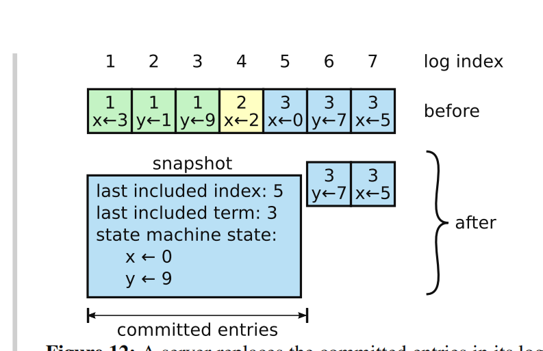

# Lab3D 日志压缩（log compaction）

## 为什么需要日志压缩？

了解redis的同学都知道，redis的aof提供了一种叫做重写的功能。他的压缩日志和raft的日志压缩是类似的，是将当前状态机的内容做一次持久化。

**核心问题：**
在长期运行的系统中，Raft日志会无限增长，这带来以下问题：
1. **存储问题**：日志占用越来越多的磁盘空间
2. **性能问题**：新节点加入或落后节点追赶时，需要重放大量历史日志
3. **内存问题**：内存中保存的日志越来越多，影响系统性能

**快照的本质思想：**
既然日志的目的是重建状态机，那么如果我们已经有了某个时刻的状态机快照，就不需要保留那个时刻之前的所有日志了。这就像是数据库的checkpoint机制。

- 日志是手段，状态机是目的
- 快照 = 状态机在某一时刻的完整状态
- 快照 + 快照之后的日志 = 完整的状态重建能力

根据raft的论文，Figure12那张图，可以看到。
一个snapshot带有几个关键的内容。
last include index
last include term
state machine state
分别是一个最后包含的日志条目的索引
最后包含的日志条目的任期
以及状态机的具体值。
这张图更好看一点。


## Lab3D 实验任务
>在 Lab 3D 中，测试器会周期性地调用 Snapshot() 。在 Lab 4 中，你将编写一个键/值服务器调用 Snapshot() ；快照将包含键/值对表的完整内容。服务层会在每个节点（而不仅仅是领导者）上调用 Snapshot() 。index 参数指示快照中反映的最高日志条目。Raft 应该丢弃该点之前的日志条目。你需要修改你的 Raft 代码，使其在仅存储日志尾部时运行。你需要实现论文中讨论的 InstallSnapshot RPC，它允许 Raft 领导者告诉落后的 Raft 节点用快照替换其状态。你可能需要思考 InstallSnapshot 应如何与图 2 中的状态和规则交互。当一个追随者的 Raft 代码接收到 InstallSnapshot RPC 时，它可以使用 applyCh 将快照发送到服务中，通过 ApplyMsg 。 ApplyMsg 结构体定义已经包含了你需要（并且测试器期望的）字段。注意确保这些快照仅推进服务的状态，而不会使其状态回退。如果服务器崩溃，它必须从持久化数据中重启。您的 Raft 应该持久化 Raft 状态和相应的快照。使用 persister.Save() 的第二个参数来保存快照。如果没有快照，将 nil 作为第二个参数传递。

在hint当中提到了，一个好的开始是修改你的代码，使其能够存储从某个索引 X 开始的日志部分。最初你可以将 X 设置为 0，并运行 3B/3C 测试。然后让 Snapshot(index) 丢弃 index 之前的日志，并将 X 设置为 index 。如果一切顺利，你现在应该可以通过第一个 3D 测试。

那么我们就按照这个思路来做实现。

## 添加日志压缩相关属性
上文中的图中已经体现了会记录三个属性。我们这里在Raft结构体当中添加：
```go
lastIncludedIndex int
lastIncludedTerm  int
```

**这两个字段的设计意图：**

`lastIncludedIndex`的作用：
- 标记快照包含的最后一个日志条目的逻辑索引
- 这个索引之前的所有日志都可以安全丢弃
- 是新旧日志的分界线

`lastIncludedTerm`的作用：
- 保存lastIncludedIndex对应日志条目的任期号
- 用于日志一致性检查，特别是在InstallSnapshot RPC中
- 确保快照的合法性和一致性

**为什么需要term？举个例子：**
假设节点A的快照lastIncludedIndex=10，lastIncludedTerm=3
节点B在索引10处有一个任期为2的日志条目
这说明两个节点在索引10处的日志不一致，B不能简单地接受A的快照

将持久化过程中的
```go
rf.persister.Save(rf.encodeState(), nil)
```
修改成
```go
snapshot := rf.persister.ReadSnapshot()
rf.persister.Save(rf.encodeState(), snapshot)
```

**为什么这里需要`rf.persister.ReadSnapshot()`？**

1. **持久化的完整性**：Raft的持久化包括两部分
   - Raft状态（term, votedFor, log等）
   - 快照数据（状态机状态）
   
2. **原子性保证**：两者必须原子性地一起保存
   - 如果只保存状态不保存快照，重启后状态不一致
   - 如果传入nil，之前的快照会丢失

3. **恢复时的依赖关系**：
   - 重启时需要先加载快照恢复状态机
   - 再重放快照之后的日志
   - 两者缺一不可

这就像数据库的WAL日志和数据页，必须保持一致性。


在encodeState当中添加对lastIncludedIndex和lastIncludedTerm的编码
```go
func (rf *Raft) encodeState() []byte {
	w := new(bytes.Buffer)
	e := labgob.NewEncoder(w)
	e.Encode(rf.log)
	e.Encode(rf.currentTerm)
	e.Encode(rf.votedFor)
	e.Encode(rf.lastIncludedIndex)
	e.Encode(rf.lastIncludedTerm)
	return w.Bytes()
}
```

readPersist也是类似，添加对这二者的读取。
```go
func (rf *Raft) readPersist(data []byte) {
	if data == nil || len(data) < 1 { 
		return
	}

	r := bytes.NewBuffer(data)
	d := labgob.NewDecoder(r)

	var log []logEntry
	var currentTerm int
	var votedFor int
	var lastIncludedIndex int
	var lastIncludedTerm int

	if d.Decode(&log) != nil ||
		d.Decode(&currentTerm) != nil ||
		d.Decode(&votedFor) != nil ||
		d.Decode(&lastIncludedIndex) != nil ||
		d.Decode(&lastIncludedTerm) != nil {
	} else {
		rf.log = log
		rf.currentTerm = currentTerm
		rf.votedFor = votedFor
		rf.lastIncludedIndex = lastIncludedIndex
		rf.lastIncludedTerm = lastIncludedTerm
	}
}
```
然后去按照之前的指引初始化snapshot方法，因为这个方法会被测试器定期调用

## 实现SnapShot方法

**Snapshot方法：**

这个方法是由上层状态机（如KV存储）主动调用的，告诉Raft"我已经把状态保存到快照了，index之前的日志可以丢弃了"。

**为什么是状态机驱动而不是Raft自己决定？**
- 只有状态机知道自己的状态是否已经持久化完成
- 状态机可以选择合适的时机（如写入压力低时）进行快照
- 避免了Raft和状态机之间的复杂同步问题

首先判断一下是否killed，然后上锁，出方法解锁，因为整个过程我们要拿到这个raft对应的状态。

**Snapshot方法的核心逻辑分析：**

1. **过期检查的含义**：
   ```
   if rf.lastIncludedIndex >= index
   ```
   - 如果当前已经有index或更新的快照，说明这个快照请求过期了
   - 这可能发生在并发场景：状态机A调用Snapshot(10)，同时收到InstallSnapshot包含index=15
   - 必须拒绝旧快照，保证单调性

2. **数组索引转换**：
   ```
   arrayIndex = index - rf.lastIncludedIndex - 1
   ```
   **为什么是这个公式？让我们推导一下：**
   
   假设当前lastIncludedIndex=30，要快照到index=35
   - 内存中的日志：[31, 32, 33, 34, 35, 36, ...]
   - 数组索引：      [0,  1,  2,  3,  4,  5, ...]
   - 要找index=35在数组中的位置：35-30-1=4 ✓
   
   **公式的本质**：`目标逻辑索引 - 当前快照边界 - 1 = 数组偏移`
```go
func (rf *Raft) getMemoryLogLength() int {
	return len(rf.log)
}
```
如果这个长度在0到我们目前内存中有的索引之间，那么是可以压缩的，不然就是非法的。

3. **任期获取的重要性**：
   ```go
   rf.lastIncludedTerm = rf.log[arrayIndex].Term
   ```
   **为什么必须保存这个term？**
   - 将来InstallSnapshot时需要进行一致性检查
   - 确保不同节点在同一个index处有相同的term
   - 这是Raft协议正确性的基础

4. **日志截断的原子性操作**：
   ```go
   ssLogs := make([]logEntry, 0)
   if arrayIndex+1 < rf.getMemoryLogLength() {
       ssLogs = append(ssLogs, rf.log[arrayIndex+1:]...)
   }
   rf.log = ssLogs
   ```
   **设计考虑**：
   - 先创建新日志切片，再替换，保证原子性
   - 保留index之后的日志，丢弃index及之前的日志
   - 如果index是最后一个日志，则内存日志为空

然后进行持久化保存。
```go
func (rf *Raft) Snapshot(index int, snapshot []byte) {
	// Your code here (3D).

	if rf.killed() {
		return
	}

	rf.mu.Lock()
	defer rf.mu.Unlock()

	//如果自己的最后应用索引已经大于这个要快照的索引，说明快照已经过期
	if rf.lastIncludedIndex >= index || index > rf.commitIndex {
		return
	}

	arrayIndex := index - rf.lastIncludedIndex - 1
	if arrayIndex < 0 || arrayIndex >= rf.getMemoryLogLength() {
		return
	}

	rf.lastIncludedTerm = rf.log[arrayIndex].Term

	ssLogs := make([]logEntry, 0)
	if arrayIndex+1 < rf.getMemoryLogLength() {
		ssLogs = append(ssLogs, rf.log[arrayIndex+1:]...)
	}

	rf.lastIncludedIndex = index
	rf.log = ssLogs // 更新日志条目

	// Persist the snapshot
	rf.persister.Save(rf.encodeState(), snapshot)

}
```
代码如上图。这样就能过第一个test了，但是我们现在没有实现InstallSnapShot这一套rpc,所以还没有完全实现逻辑。

## 实现InstallSnapshot RPC

**InstallSnapshot RPC**

这个RPC解决了一个根本性问题：当leader无法通过增量日志同步follower时，如何进行全量状态同步？

**为什么需要这个RPC？传统AppendEntries的局限性：**
1. **依赖连续性**：AppendEntries需要prevLogIndex处的日志存在
2. **无法跨越gap**：如果中间日志被压缩，无法构造有效的AppendEntries
3. **效率问题**：即使能重放，对于大gap也太慢

**InstallSnapshot的核心思想：**
"既然增量同步不可行，就直接给你完整状态"

按照论文，rpc的定义：

**Arguments参数详解：**
- `term`：leader的term（用于任期检查）
- `leaderId`：leader的id（follower需要知道是谁发的）
- `lastIncludedIndex`：快照包含的最后日志索引（边界标记）
- `lastIncludedTerm`：快照包含的最后日志任期（一致性检查）
- `offset`：快照的偏移量（用于分片传输，lab中不实现）
- `data[]`：快照数据（状态机的完整状态）
- `done`：是否完成（分片传输标记，lab中不实现）

**Result参数：**
- `term`：接收者的currentTerm（让leader检测自己是否过期）

**lab简化设计：**
在lab的hint中提及，在一个 InstallSnapshot RPC 中发送整个快照。不要实现图 13 的 offset 机制来分割快照。

所以我们最后的结构体定义如下：

```go
type InstallSnapshotArgs struct {
	Term              int    //leader's term
	LeaderId          int    //leader's ID
	LastIncludedIndex int    //快照包含的最后日志条目的索引
	LastIncludedTerm  int    //快照包含的最后日志条目的任期号
	Data              []byte //快照数据

}

type InstallSnapshotReply struct {
	Term int //接收者当前任期
}
```

**InstallSnapshot方法的处理逻辑深度解析：**

这个方法是follower收到leader发来的快照时的处理逻辑，需要仔细考虑各种边界情况。

**第一步：任期检查的重要性**
```go
if args.Term < rf.currentTerm {
    reply.Term = rf.currentTerm
    return
}
```
**为什么必须先检查任期？**
- 过期的leader不应该影响当前系统状态
- 这是Raft协议的基本安全性保证
- 任期是分布式系统中的逻辑时钟

**第二步：快照新旧判断**
```go
if args.LastIncludedIndex <= rf.lastIncludedIndex {
    return
}
```
**逻辑分析：**
- 如果收到的快照比当前的还旧，说明网络延迟或重传
- 快照的单调性：只接受更新的快照，拒绝旧快照
- 避免状态回退，保证"只前进不后退"的原则

**第三步：日志一致性检查（最复杂的部分）**

这里要解决一个关键问题：**快照和现有日志如何合并？**

**场景1：完全替换**
```
当前状态：[1,2,3,4,5,6,7,8,9,10]
收到快照：lastIncludedIndex=10, lastIncludedTerm=3
检查：log[10].term != 3
结果：丢弃所有日志，完全使用快照
```

**场景2：部分保留**
```
当前状态：[1,2,3,4,5,6,7,8,9,10,11,12]
收到快照：lastIncludedIndex=10, lastIncludedTerm=3  
检查：log[10].term == 3
结果：保留[11,12]，丢弃[1-10]
```

**场景3：快照超前**
```
当前状态：[1,2,3,4,5]
收到快照：lastIncludedIndex=10
结果：当前日志全部丢弃，等待后续AppendEntries
```

**为什么需要term匹配检查？**
- 确保在同一逻辑时刻的状态一致性
- 防止因为网络分区导致的状态混乱
- 这是Raft协议正确性的核心保证

接下来我们去实现InstallSnapshot的方法：

1. **任期检查**：如果接收者的term大于leader传入的term，直接返回currentTerm；否则更新任期，变成follower
2. **重复检查**：如果已经有这个快照了，直接返回，避免重复处理
3. **日志一致性检查**：检查快照的includedIndex和term是否和当前内存中的日志一致，决定保留哪些日志
4. **状态更新**：保存快照数据，更新相关索引
5. **应用快照**：通过applyCh将快照发送给状态机

```go
func (rf *Raft) InstallSnapshot(args *InstallSnapshotArgs, reply *InstallSnapshotReply) {


	rf.mu.Lock()
	defer rf.mu.Unlock()

	if args.Term < rf.currentTerm {
		reply.Term = rf.currentTerm
		return
	}
	if args.Term > rf.currentTerm {
		rf.currentTerm = args.Term
		rf.votedFor = -1
		rf.state = Follower
		rf.persist()
	}

	reply.Term = rf.currentTerm
	rf.lastHeartbeat = time.Now()

	if args.LastIncludedIndex <= rf.lastIncludedIndex {

		return
	}


	newLog := make([]logEntry, 0)


	if rf.hasLogEntry(args.LastIncludedIndex) {
		if rf.getLogTerm(args.LastIncludedIndex) == args.LastIncludedTerm {

			startArrayIndex := rf.logicalToArrayIndex(args.LastIncludedIndex + 1)
			if startArrayIndex >= 0 && startArrayIndex < rf.getMemoryLogLength() {
				newLog = make([]logEntry, rf.getMemoryLogLength()-startArrayIndex)
				copy(newLog, rf.log[startArrayIndex:])
			}
		}
	}

	rf.persister.Save(rf.encodeState(), args.Data)

	rf.lastIncludedIndex = args.LastIncludedIndex
	rf.lastIncludedTerm = args.LastIncludedTerm

	rf.log = newLog

	if rf.commitIndex < args.LastIncludedIndex {
		rf.commitIndex = args.LastIncludedIndex
	}
	if rf.lastApplied < args.LastIncludedIndex {
		rf.lastApplied = args.LastIncludedIndex
	}

	rf.applyCh <- raftapi.ApplyMsg{
		SnapshotValid: true,
		Snapshot:      args.Data,
		SnapshotTerm:  args.LastIncludedTerm,
		SnapshotIndex: args.LastIncludedIndex,
	}
}
```

## 对于日志的调整
这里说一下memoryLog,日志条目总数，逻辑日志，索引日志的关系。

内存日志顾名思义，就是当前raft节点中储存着的，快照前的内容会被从内存中剔除通过go的gc.
```go
// 获取当前内存中的日志条目数量
func (rf *Raft) getMemoryLogLength() int {
	return len(rf.log)
}

```

**数组索引和逻辑索引的关系：**

这是Lab3D最容易混淆的概念，让我们通过具体例子来理解：

**场景设定**：
- 系统启动后产生了36条日志（逻辑索引1-36）
- 前30条进行了快照（lastIncludedIndex=30）
- 当前内存状态：

```
逻辑索引:   [1, 2, 3, ..., 30] | [31, 32, 33, 34, 35, 36]
存储位置:   [    快照中    ] | [  内存log数组中  ]
数组索引:   [      无     ] | [ 0,  1,  2,  3,  4,  5]
```

**转换公式的推导**：
- 逻辑索引32要找在数组中的位置
- 32 - 30(lastIncludedIndex) - 1 = 1  
- 验证：log[1]确实对应逻辑索引32 ✓

**为什么要减1？数学本质分析：**

这涉及到两个坐标系的映射：
1. **逻辑坐标系**：[1, 2, 3, ..., ∞]（全局递增）
2. **数组坐标系**：[0, 1, 2, ..., len-1]（局部索引）

映射关系：
```
逻辑索引范围：[lastIncludedIndex+1, lastIncludedIndex+len(log)]
数组索引范围：[0, len(log)-1]
```

转换公式推导：
```
设逻辑索引为L，数组索引为A
L = lastIncludedIndex + A + 1
因此：A = L - lastIncludedIndex - 1
```

**减1的物理意义**：
- lastIncludedIndex是快照的"边界"
- 内存日志从lastIncludedIndex+1开始
- 但数组索引从0开始，所以需要offset调整

**这种设计的优势**：
- 保持逻辑索引的全局唯一性和连续性
- 支持动态的快照边界调整
- 简化了日志查找和一致性检查
```go
func (rf *Raft) logicalToArrayIndex(logicalIndex int) int {
	return logicalIndex - rf.lastIncludedIndex - 1
}
```
同理，可以将数组索引转换成逻辑索引
```go
func (rf *Raft) arrayToLogicalIndex(arrayIndex int) int {
	return rf.lastIncludedIndex + arrayIndex + 1
}
```

同样在我们之前的getlogTerm什么的逻辑也要做修改。因为内存中不存着所有的索引和任期了。
```go
func (rf *Raft) getLogTerm(index int) int {
	if index < 0 {
		return -1
	}
	if index == 0 {
		return 0 // 索引0的日志条目任期为0
	}
	if index <= rf.lastIncludedIndex {
		return rf.lastIncludedTerm
	}

	arrayIndex := index - rf.lastIncludedIndex - 1
	if arrayIndex < 0 || arrayIndex >= rf.getMemoryLogLength() {
		return -1
	}
	return rf.log[arrayIndex].Term
}
```
具体的方法，就是你给我一个逻辑索引，传入一个逻辑索引，我会转换成数组索引，然后拿出来给你。
类似的方法，拿到对应的任期
```go
func (rf *Raft) getLogTerm(index int) int {
	if index < 0 {
		return -1
	}
	if index == 0 {
		return 0 
	}
	if index <= rf.lastIncludedIndex {
		return rf.lastIncludedTerm
	}

	arrayIndex := index - rf.lastIncludedIndex - 1
	if arrayIndex < 0 || arrayIndex >= rf.getMemoryLogLength() {
		return -1
	}
	return rf.log[arrayIndex].Term
}

// 获取最后一个日志条目的逻辑索引
func (rf *Raft) getLastLogIndex() int {
	if rf.getMemoryLogLength() == 0 {
		return rf.lastIncludedIndex
	}
	return rf.lastIncludedIndex + rf.getMemoryLogLength()
}
```
这样，我们的回退方法也要做修改使用内存日志。
```go
func (rf *Raft) optimizeNextIndex(server int, reply *AppendEntriesReply) int {
	if reply.XTerm == -1 {
		return reply.XLen
	}
	conflictTerm := reply.XTerm
	lastIndexOfXTerm := -1

	for i := rf.getMemoryLogLength() - 1; i >= 0; i-- {
		if rf.log[i].Term == conflictTerm {
			lastIndexOfXTerm = i + rf.lastIncludedIndex + 1 
			break
		}
	}

	if lastIndexOfXTerm != -1 {
		return lastIndexOfXTerm + 1
	} else {
		return reply.XIndex
	}
}

```

## RPC发送时机分析

**场景重现：为什么需要InstallSnapshot？**

考虑这个场景：
1. Leader已经做了快照，lastIncludedIndex=100
2. Follower很久没有联系，nextIndex[follower]=80
3. Leader想发送日志给Follower，但是索引80的日志已经被快照了！

**传统AppendEntries的困境：**
```go
// Leader想发送AppendEntries
prevLogIndex = nextIndex[follower] - 1 = 79
// 但是Leader已经没有索引79的日志了！
// 无法构造AppendEntries请求
```

**InstallSnapshot的解决方案：**
```
if nextIndex[follower] <= rf.lastIncludedIndex {
    // 发送InstallSnapshot而不是AppendEntries
    sendInstallSnapshot(follower)
}
```

**判断条件的数学含义：**
- `nextIndex[follower] <= lastIncludedIndex` 意味着follower需要的日志已经被压缩了
- 这时只有两个选择：要么重建所有历史日志（不现实），要么发送快照
- InstallSnapshot是唯一可行的同步方式

**这体现了分布式系统的一个重要原理：**
当增量同步不可行时，必须进行全量同步。

我们写好send方法。

**时序问题的剖析：**

```go
snapshotData := rf.persister.ReadSnapshot()
if len(snapshotData) == 0 {
    time.Sleep(10 * time.Millisecond)
    snapshotData = rf.persister.ReadSnapshot()
}
```

**为什么会出现快照为空的情况？深入分析：**

**快照生成的时序窗口**：
   ```
   T1: 状态机调用Snapshot()
   T2: Raft开始处理，更新lastIncludedIndex  ← 此时认为快照"存在"
   T3: 调用persister.Save()持久化        ← 实际写入磁盘
   T4: 另一个goroutine调用ReadSnapshot() ← 可能读到空数据
   ```
   
   **关键问题**：T2和T3之间存在时间窗口，在这个窗口内：
   - Raft认为快照已经存在（lastIncludedIndex已更新）
   - 但物理存储还没有完成
   - 其他goroutine读取会失败


**更新索引的逻辑推理：**
- 发送快照成功意味着follower现在的状态=lastIncludedIndex时的状态
- nextIndex[follower] = lastIncludedIndex + 1（下一个要发送的日志）
- matchIndex[follower] = lastIncludedIndex（已确认复制的最大索引）

这保证了后续的AppendEntries能够正确接续。

```go
func (rf *Raft) sendInstallSnapshotToPeer(server int) {
	// 读取快照数据
	snapshotData := rf.persister.ReadSnapshot()

	// 检查快照数据是否为空
	if len(snapshotData) == 0 {
		// 重新尝试读取快照，可能存在时序问题
		time.Sleep(10 * time.Millisecond)
		snapshotData = rf.persister.ReadSnapshot()
		if len(snapshotData) == 0 {
			return
		}

	}

	// 准备 InstallSnapshot 参数
	args := &InstallSnapshotArgs{
		Term:              rf.currentTerm,
		LeaderId:          rf.me,
		LastIncludedIndex: rf.lastIncludedIndex,
		LastIncludedTerm:  rf.lastIncludedTerm,
		Data:              snapshotData,
	}
	currentTerm := rf.currentTerm


	go func() {
		reply := &InstallSnapshotReply{}
		if rf.peers[server].Call("Raft.InstallSnapshot", args, reply) {
			rf.mu.Lock()
			defer rf.mu.Unlock()

			if rf.state != Leader || rf.currentTerm != currentTerm {
				return
			}

			if reply.Term > rf.currentTerm {
				rf.currentTerm = reply.Term
				rf.state = Follower
				rf.votedFor = -1
				rf.persist()
				rf.electionTimer.Reset(rf.getRandomElectionTimeout())
				return
			}
 matchIndex
			rf.nextIndex[server] = args.LastIncludedIndex + 1
			rf.matchIndex[server] = args.LastIncludedIndex


			// 检查是否可以提交新的日志条目
			rf.updateCommitIndex()
		} else {
		}
	}()
}
```

既然有了发送快照的逻辑，我们该思考什么时候发送快照呢，或者说，我们究其根本，什么时候会发现需要发送快照，我们就想什么时候nextIndex需要更新呢？是在心跳的时候

在检查完当前是否是leader后，检查一下是否需要发送快照，如果需要就发送快照。

```go
func (rf *Raft) sendHeartbeats() {
	if rf.state != Leader {
		return
	}

	for i := range rf.peers {
		if i == rf.me {
			continue
		}
		go func(server int) {
			rf.mu.Lock()
			if rf.state != Leader {
				rf.mu.Unlock()
				return
			}

			// 检查是否需要发送快照
			if rf.nextIndex[server] <= rf.lastIncludedIndex {
				// 需要的日志在快照中，发送 InstallSnapshot
				rf.sendInstallSnapshotToPeer(server)
				rf.mu.Unlock()
				return
			}

			// 检查是否有新的日志条目需要发送
			prevLogIndex := rf.nextIndex[server] - 1
			var entries []logEntry

			if rf.nextIndex[server] <= rf.getLastLogIndex() {
				startArrayIndex := rf.nextIndex[server] - rf.lastIncludedIndex - 1
				if startArrayIndex >= 0 && startArrayIndex < rf.getMemoryLogLength() {
					entries = make([]logEntry, rf.getMemoryLogLength()-startArrayIndex)
					copy(entries, rf.log[startArrayIndex:])
				} else {
					entries = make([]logEntry, 0)
				}
			} else {
）				entries = make([]logEntry, 0)
			}

			args := &AppendEntriesArgs{
				Term:              rf.currentTerm,
				LeaderId:          rf.me,
				PrevLogIndex:      prevLogIndex,
				PrevLogTerm:       rf.getLogTerm(prevLogIndex),
				Entries:           entries,
				LeaderCommitIndex: rf.commitIndex,
			}
			rf.mu.Unlock()

			reply := &AppendEntriesReply{}

			if ok := rf.peers[server].Call("Raft.AppendEntries", args, reply); ok {
				rf.mu.Lock()
				// 检查是否仍然是相同任期的 Leader
				if rf.state != Leader || rf.currentTerm != args.Term {
					rf.mu.Unlock()
					return
				}

				if reply.Term > rf.currentTerm {
					rf.currentTerm = reply.Term
					rf.state = Follower
					rf.votedFor = -1
					rf.electionTimer.Reset(rf.getRandomElectionTimeout())
					rf.persist() // 持久化状态变化
				} else if reply.Success {
					rf.nextIndex[server] = args.PrevLogIndex + len(args.Entries) + 1
					rf.matchIndex[server] = args.PrevLogIndex + len(args.Entries)
					if len(args.Entries) > 0 {
						rf.updateCommitIndex()
					}
				} else {
					// 失败，使用快速回退算法
					if reply.Term <= rf.currentTerm {
						rf.nextIndex[server] = rf.optimizeNextIndex(server, reply)
					}
				}
				rf.mu.Unlock()
			}
		}(i)
	}
}
```

## 修改Make初始化

**快照恢复的关键问题：状态一致性**

当节点重启时，会遇到一个微妙的状态恢复问题：

**问题场景：**
1. 节点重启前：lastIncludedIndex=100, lastApplied=150
2. 重启后读取持久化状态：lastIncludedIndex=100, lastApplied=0（默认值）
3. 如果不处理，applier会尝试重放索引1-100的日志，但这些日志已经在快照中了。

**为什么必须调整lastApplied？**
```go
if rf.lastApplied < rf.lastIncludedIndex {
    rf.lastApplied = rf.lastIncludedIndex
}
```

**原因分析：**
1. **快照的语义**：lastIncludedIndex意味着索引1到lastIncludedIndex的所有日志都已经被应用到状态机了
2. **applier的假设**：从lastApplied+1开始重放日志
3. **一致性要求**：不能重复应用已经在快照中的日志

**为什么这么设计？**
在分布式系统中，恢复过程必须维护"exactly-once"的语义：
- 每个日志条目恰好被应用一次
- 快照和日志重放不能有重叠
- 状态机的状态必须是确定性的

**applier中的时序协调**

在applier的for循环中也做一样的确认。

**applier的核心挑战：并发安全的日志应用**

applier面临的复杂情况：
1. 正在应用日志时，可能收到InstallSnapshot
2. 快照可能覆盖正在应用的日志区间
3. 必须保证应用的顺序性和唯一性

**为什么需要hasLogEntry检查？**
```go
if !rf.hasLogEntry(applyIndex) {
    break // 等待日志到达或快照更新
}
```

**可能的情况分析：**
1. **日志还没到达**：commitIndex更新了，但对应的日志还在网络传输中
2. **日志被快照了**：在应用过程中，该日志被InstallSnapshot覆盖了
3. **索引转换错误**：逻辑索引超出了当前内存日志的范围


**applier分析：**

applier是整个Raft系统中最微妙的组件之一，它需要处理多个维度的复杂性：

**1. 时序维度的挑战：**
```
时间线：T1--------T2--------T3--------T4
T1: commitIndex更新为10
T2: applier开始处理索引6
T3: 收到InstallSnapshot，lastIncludedIndex=8
T4: applier尝试应用索引6，但已经被快照了！
```

**解决方案的智慧：**
- 不是预防这种情况（不可能），而是处理
- 通过hasLogEntry检查，发现问题时退避等待
- 依靠lastApplied的单调性保证最终正确

**2. 状态机一致性的保证：**

**核心不变量：**
`已应用到状态机的 = [1, lastApplied] 的所有索引`

**面临的破坏因素：**
- 快照可能跳跃式更新lastApplied
- 并发的日志应用和快照安装
- 网络延迟导致的乱序

**设计：**
```go
if rf.lastApplied < rf.lastIncludedIndex {
    rf.lastApplied = rf.lastIncludedIndex
}
```
这一行代码看似简单，实际上：
- 维护了状态机的一致性不变量
- 处理了快照恢复的边界情况
- 保证了幂等性（多次执行结果相同）

**3. 为什么先收集再发送？**

```go
var toApply []ApplyMsg
// 在锁内收集
for rf.lastApplied < rf.commitIndex {
    // ...收集逻辑
}
rf.mu.Unlock()

// 在锁外发送
for _, msg := range toApply {
    rf.applyCh <- msg
}
```

**死锁风险分析：**
假如在锁内发送：
```
applier: 持有rf.mu，尝试发送到applyCh
应用层: 处理applyCh消息，可能调用Raft方法需要rf.mu
结果: 循环等待，死锁发生
```

把逻辑日志转化为数组索引，判断是否为空，再用逻辑索引应用到状态机上。这里需要特别注意索引转换的正确性。

完整实现如下
```go
func (rf *Raft) applier() {
	for !rf.killed() {
		rf.mu.Lock()

		// 确保 lastApplied 不会小于 lastIncludedIndex
		if rf.lastApplied < rf.lastIncludedIndex {
			rf.lastApplied = rf.lastIncludedIndex
		}

		// 检查是否有新的日志条目需要应用
		if rf.lastApplied >= rf.commitIndex {
			rf.mu.Unlock()
			time.Sleep(10 * time.Millisecond)
			continue
		}

		// 一次性收集所有需要应用的条目，避免在发送过程中释放锁
		var toApply []raftapi.ApplyMsg

		for rf.lastApplied < rf.commitIndex {
			applyIndex := rf.lastApplied + 1

			// 检查是否有该日志条目
			if !rf.hasLogEntry(applyIndex) {
				break
			}

			rf.lastApplied++

			arrayIndex := rf.logicalToArrayIndex(applyIndex)
			if rf.log[arrayIndex].Command != nil {
				logicalIndex := rf.log[arrayIndex].LogIndex
				applyMsg := raftapi.ApplyMsg{
					CommandValid: true,
					Command:      rf.log[arrayIndex].Command,
					CommandIndex: logicalIndex,
				}
				toApply = append(toApply, applyMsg)
			}
		}
		rf.mu.Unlock()

		// 按顺序发送所有待应用的消息
		for _, msg := range toApply {
			rf.applyCh <- msg
		}

		time.Sleep(10 * time.Millisecond)
	}
}
```

然后我们进行测试
```bash
/mnt/d/co/mit65840/src/raft1  main !1  go test
```

拿到以下结果
```
Test (3A): initial election (reliable network)...
  ... Passed --  time  3.0s #peers 3 #RPCs    60 #Ops    0
Test (3A): election after network failure (reliable network)...
  ... Passed --  time  4.6s #peers 3 #RPCs   150 #Ops    0
Test (3A): multiple elections (reliable network)...
  ... Passed --  time  5.5s #peers 7 #RPCs   814 #Ops    0
Test (3B): basic agreement (reliable network)...
  ... Passed --  time  0.5s #peers 3 #RPCs    16 #Ops    0
Test (3B): RPC byte count (reliable network)...
  ... Passed --  time  1.3s #peers 3 #RPCs    48 #Ops    0
Test (3B): test progressive failure of followers (reliable network)...
  ... Passed --  time  4.4s #peers 3 #RPCs   144 #Ops    0
Test (3B): test failure of leaders (reliable network)...
  ... Passed --  time  4.7s #peers 3 #RPCs   202 #Ops    0
Test (3B): agreement after follower reconnects (reliable network)...
  ... Passed --  time  5.3s #peers 3 #RPCs   134 #Ops    0
Test (3B): no agreement if too many followers disconnect (reliable network)...
  ... Passed --  time  3.2s #peers 5 #RPCs   248 #Ops    0
Test (3B): concurrent Start()s (reliable network)...
  ... Passed --  time  0.5s #peers 3 #RPCs    22 #Ops    0
Test (3B): rejoin of partitioned leader (reliable network)...
  ... Passed --  time  5.7s #peers 3 #RPCs   188 #Ops    0
Test (3B): leader backs up quickly over incorrect follower logs (reliable network)...
  ... Passed --  time 16.6s #peers 5 #RPCs  2283 #Ops    0
Test (3B): RPC counts aren't too high (reliable network)...
  ... Passed --  time  2.0s #peers 3 #RPCs    62 #Ops    0
Test (3C): basic persistence (reliable network)...
  ... Passed --  time  2.9s #peers 3 #RPCs    78 #Ops    0
Test (3C): more persistence (reliable network)...
  ... Passed --  time  9.7s #peers 5 #RPCs   476 #Ops    0
Test (3C): partitioned leader and one follower crash, leader restarts (reliable network)...
  ... Passed --  time  1.6s #peers 3 #RPCs    44 #Ops    0
Test (3C): Figure 8 (reliable network)...
  ... Passed --  time 28.2s #peers 5 #RPCs  1530 #Ops    0
Test (3C): unreliable agreement (unreliable network)...
  ... Passed --  time  1.3s #peers 5 #RPCs  1063 #Ops    0
Test (3C): Figure 8 (unreliable) (unreliable network)...
  ... Passed --  time 35.0s #peers 5 #RPCs 10617 #Ops    0
Test (3C): churn (reliable network)...
  ... Passed --  time 16.1s #peers 5 #RPCs 15112 #Ops    0
Test (3C): unreliable churn (unreliable network)...
  ... Passed --  time 16.1s #peers 5 #RPCs  5878 #Ops    0
Test (3D): snapshots basic (reliable network)...
  ... Passed --  time  2.3s #peers 3 #RPCs   492 #Ops    0
Test (3D): install snapshots (disconnect) (reliable network)...
  ... Passed --  time 37.0s #peers 3 #RPCs  1508 #Ops    0
Test (3D): install snapshots (disconnect) (unreliable network)...
  ... Passed --  time 63.3s #peers 3 #RPCs  2290 #Ops    0
Test (3D): install snapshots (crash) (reliable network)...
  ... Passed --  time 23.8s #peers 3 #RPCs  1193 #Ops    0
Test (3D): install snapshots (crash) (unreliable network)...
  ... Passed --  time 36.0s #peers 3 #RPCs  1610 #Ops    0
Test (3D): crash and restart all servers (unreliable network)...
  ... Passed --  time 10.7s #peers 3 #RPCs   370 #Ops    0
Test (3D): snapshot initialization after crash (unreliable network)...
  ... Passed --  time  2.9s #peers 3 #RPCs    92 #Ops    0
PASS
ok      6.5840/raft1    343.980s
```

以上就是整个lab3的实现过程。