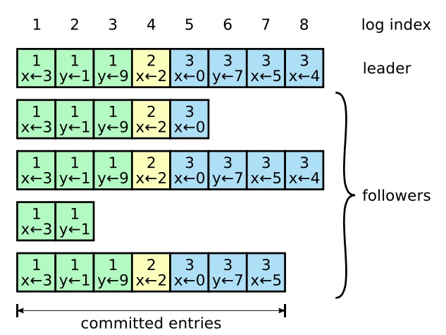

# Raft算法论文研究


## 1. Raft算法概述

Raft算法是一种用于分布式系统的一致性算法，相比Paxos更易理解和实现。

### 1.1 Raft算法的三个重要组成部分

| 组成部分 | 描述 |
|----------|------|
| **强领导人** | 日志条目只从leader发送给其他服务器，简化了日志管理 |
| **领导选举** | 使用随机计时器来选择leader，避免选票分割 |
| **成员关系调整** | 成员变换时系统仍然可以正常工作 |

## 2. 复制状态机（Replicated State Machine）

### 2.1 核心概念
复制状态机的目的是让一组服务器组成的集群产生相同的副本状态。典型应用包括：
- 管理领导选举
- 存储配置信息
- 在领导人宕机的情况下保持系统存活

### 2.2 实现原理
复制状态机基于复制日志实现：

1. **日志存储**：每个服务器存储一个包含一系列指令的日志
2. **顺序执行**：按照日志顺序执行，每个日志都包含相同的指令
3. **状态同步**：每个服务器的行为保持同步

### 2.3 一致性保证
一致性算法的目的是保证复制日志的一致性：
- 服务器间通过通信保证每个服务器上的日志都以相同顺序包含相同请求
- 即使部分服务器发生故障，指令被正确复制后仍能正常工作
- 每个服务器的状态机按照日志顺序处理指令，返回结果给客户端
- 整个集群达到高可用状态

## 3. 拜占庭将军问题（Byzantine Generals Problem）

### 3.1 问题背景
一群拜占庭将军各自率领一支军队，共同围攻一座敌城。他们需要达成一致的行动策略（例如，同时进攻或同时撤退），否则如果一部分进攻一部分撤退，将导致灾难性的失败。

### 3.2 核心挑战
在只能靠信使进行通信的场景下存在两个主要问题：

| 问题类型 | 描述 | 分布式系统对应 |
|----------|------|----------------|
| **将军叛变** | 将军可能叛变，发送虚假信息 | 恶意节点问题 |
| **信使问题** | 信使可能被截杀，消息可能被篡改 | 不可靠通信问题 |

### 3.3 解决思路
需要使用复杂的算法和协议保证即使存在一定数量的恶意节点的情况下，忠诚的节点仍然能达成共识，实现容错算法。

## 4. 一致性算法的关键特性

一般来说，一致性算法需要具备以下特性：

### 4.1 核心特性列表

| 特性 | 描述 |
|------|------|
| **安全性保障** | 在非拜占庭问题下，包括网络延迟、分区、丢包、重复和乱序等问题都可以保证正确性 |
| **可用性** | 只要集群中有大多数机器可用并且可以相互通信、和客户端通信，系统就可用 |
| **时序独立性** | 不依赖时序保证一致性；物理时钟和极端消息延迟只有在最坏情况下才会导致可用性问题 |
| **性能优化** | 通常情况下，一条指令可以在集群中的大多数节点响应一轮远程过程调用时快速完成，小部分节点的缓慢不会影响整体系统性能 |


## 5. Paxos算法分析

### 5.1 Paxos算法存在的问题

1. **理解困难**：算法复杂，难以理解和实现
2. **工程实践困难**：没有提供足够好的基础来构建现实系统
   - 单决策分解会产生其他问题
   - Paxos使用对等的点对点方式作为核心
   - 在简化世界中有意义，但现实系统很少使用这种方式
   - 对于一系列决策，选择领导人协调所有决议更加简单快速

### 5.2 Paxos算法核心角色

> **注意**：这些角色不一定对应物理机器，一个物理机器可能身兼数职。

| 角色 | 职责 |
|------|------|
| **Proposer** | 提议一个值，说服Acceptor接受这个值 |
| **Acceptor** | 负责对Proposer的提案进行投票，是达成共识的关键 |
| **Learner** | 负责学习已经达成的共识，即学习Acceptor已经接受的值 |

### 5.3 Paxos算法执行流程

Paxos算法分为两个阶段：

#### 阶段一：Prepare阶段
1. **发送Prepare请求**：Proposer发送带有唯一递增提案ID N的prepare请求
2. **Acceptor响应**：
   - 如果Acceptor已经promise过更高编号的请求，则拒绝
   - 否则承诺不再接收小于该ID的请求
   - 向Proposer返回之前接受的最大编号提案ID以及提案值

#### 阶段二：Accept阶段
1. **决定提案值**：根据prepare阶段的反馈决定一个值并让Acceptor接受
2. **处理响应**：在收到多数Acceptor的prepare响应后
   - 如果所有响应都没有带上之前接受的值，Proposer可以提出自己想要的决策值
   - 如果至少一个带上了之前接受的值，Proposer必须选择所有响应中编号最大的那个值V
3. **发送Accept请求**：向所有Acceptor发送accept(N, V)
4. **Acceptor决策**：
   - 判断N是否大于之前在prepare阶段承诺过的最高编号
   - 如果是，则接受这个值并存储N和V
   - 否则拒绝
5. **达成共识**：当一个Proposer的提案被多数Acceptor接受时，该值被选中，共识达成
6. **学习阶段**：Learner通过多种方式学习被选中的值（定期询问Acceptor或Acceptor主动通知）

## 6. Raft相对于Paxos的设计改进

Raft在设计上相对于Paxos做出了以下努力：

### 6.1 设计原则

| 改进点 | 具体措施 | 效果 |
|--------|----------|------|
| **问题分解** | 将复杂问题分解成相对独立、便于理解的子问题 | 提高算法可理解性 |
| **状态简化** | 减少状态数量，简化需要考虑的状态空间 | 让系统更加连贯 |
| **日志限制** | 所有日志不允许有空洞 | 限制日志间变成不一致状态的可能性 |
| **随机化** | 通过随机化方法增加不确定性 | 减少状态空间数量，简化选举算法 |

### 6.2 核心优势
- 通过处理所有可能选择时使用相似的方法
- 使用随机化来简化整个选举算法
- 相比Paxos更容易理解和实现

## 7. Raft一致性算法详解

### 7.1 核心思想
Raft通过选举出一个leader，给予其全部管理复制日志的责任来实现一致性。Leader负责：
- 从客户端接收日志条目
- 将日志条目复制到其他服务器上
- 告诉其他服务器何时可以将日志条目应用到状态机中

当leader发生故障或与其他服务器失去连接时，会选出新的领导人。

### 7.2 问题分解
通过leader的方式，Raft将一致性问题拆分为三个相对独立的子问题：

| 子问题 | 描述 | 目的 |
|--------|------|------|
| **领导选举** | 故障转移时选举新的领导人 | 保证系统连续性 |
| **日志复制** | 从客户端接收日志条目，复制到集群其他节点 | 强制其他节点日志与leader保持一致 |
| **安全性** | 确保任何服务器节点已应用的日志条目不会被其他服务器在同一索引位置应用不同指令 | 通过选举机制的额外限制解决 |

## 8. Raft服务器状态

### 8.1 所有服务器的持久性状态
这些状态必须在重启前持久化到稳定存储设备：

| 状态变量 | 中文名称 | 详细描述 | 初始值 |
|----------|----------|----------|--------|
| `currentTerm` | 当前任期号 | 服务器已知的最新任期编号，用于检测过期信息 | 0 |
| `votedFor` | 本任期投票对象 | 在当前任期中投票给的候选人ID，如果没有投给任何人则为空 | null |
| `log[]` | 日志条目数组 | 存储日志条目的数组，每个条目包含状态机命令以及领导者接收该条目时的任期号 | 初始索引为1 |

### 8.2 所有服务器上的易失性状态
这些状态在重启时会丢失：

| 状态变量 | 中文名称 | 详细描述 | 初始值 |
|----------|----------|----------|--------|
| `commitIndex` | 已提交索引 | 已知已被大多数服务器复制的最高日志条目的索引 | 0，递增 |
| `lastApplied` | 已应用索引 | 已经被应用到状态机的最高日志条目的索引 | 0，递增 |

### 8.3 Leader上的易失性状态
选举后重新初始化，用于管理日志复制：

| 状态变量 | 中文名称 | 详细说明 | 初始值 |
|----------|----------|----------|--------|
| `nextIndex[]` | 下一发送索引数组 | 针对每个跟随者，记录下一个要发送给该跟随者的日志条目索引位置 | leader最后日志条目索引+1 |
| `matchIndex[]` | 匹配索引数组 | 针对每个跟随者，记录已知成功复制到该跟随者的最高日志条目索引 | 0，递增 |

#### nextIndex 和 matchIndex 工作机制详解

**nextIndex 机制**：
- **作用目的**：跟踪每个跟随者的日志同步进度，决定从哪个位置开始发送日志条目
- **初始化时机**：领导者刚当选时，对所有跟随者初始化为 `lastLogIndex + 1`（乐观假设所有跟随者都是最新的）
- **动态调整**：
  - **成功响应**：如果AppendEntries成功，`nextIndex` 增加发送的日志条目数量
  - **失败响应**：如果因日志不一致失败，`nextIndex` 递减并重试，直到找到一致点
- **一致性保证**：通过逐步回退机制确保找到跟随者与领导者日志的最后共同点

**matchIndex 机制**：
- **作用目的**：记录确认已复制成功的日志进度，用于安全的提交决策
- **更新时机**：只有在收到跟随者的成功响应后才更新
- **提交决策**：领导者根据 `matchIndex` 数组计算大多数服务器都已复制的日志条目，安全地推进 `commitIndex`
- **安全性保证**：确保只有在大多数服务器确认复制后才提交日志条目

## 9. Raft RPC接口详解

### 9.1 追加条目RPC（AppendEntries RPC）
**调用者**：Leader（领导者）
**作用**：用于日志复制和心跳保活

#### 请求参数详解
| 参数名称 | 中文名称 | 详细说明 |
|----------|----------|----------|
| `term` | 领导者当前任期号 | 发送请求的领导者所处的任期，用于检测任期冲突 |
| `leaderId` | 领导者服务器标识 | 领导者的唯一标识符，便于跟随者将客户端请求重定向到正确的领导者 |
| `prevLogIndex` | 前一条日志索引 | 新日志条目紧邻的前一个日志条目的索引位置，用于一致性检查 |
| `prevLogTerm` | 前一条日志任期号 | 前一个日志条目所属的任期号，与prevLogIndex配合确保日志一致性 |
| `entries[]` | 待复制日志条目数组 | 需要被复制到跟随者的新日志条目（心跳消息时此数组为空） |
| `leaderCommit` | 领导者提交索引 | 领导者已知的最高已提交日志条目索引，用于推进跟随者的提交进度 |

#### 返回值详解
| 参数名称 | 中文名称 | 详细说明 |
|----------|----------|----------|
| `term` | 接收者当前任期号 | 跟随者的当前任期，帮助领导者发现自己是否已过期 |
| `success` | 日志一致性检查结果 | 表示跟随者是否成功通过一致性检查并接受了新日志条目 |

#### 接收者实现逻辑（Follower或Candidate执行）
1. **任期检查**：如果 `term`(领导者任期) < `currentTerm`(本地当前任期)，返回 `{term: currentTerm, success: false}`
2. **一致性检查**：如果本地日志在 `prevLogIndex`(前一日志索引) 位置不存在条目，或该位置条目的任期不等于 `prevLogTerm`(前一日志任期)，返回 `{term: currentTerm, success: false}`
3. **冲突解决**：如果发现新条目与现有条目冲突（同一索引位置任期不同），删除该条目及其之后的所有条目
4. **日志追加**：将 `entries[]`(待复制日志数组) 中尚未存在的新条目追加到本地日志
5. **提交更新**：如果 `leaderCommit`(领导者提交索引) > `commitIndex`(本地提交索引)，则更新 `commitIndex = min(leaderCommit, 最新条目索引)`

### 9.2 请求投票RPC（RequestVote RPC）
**调用者**：Candidate（候选人）
**作用**：候选人请求其他服务器投票支持自己成为领导者

#### 请求参数详解
| 参数名称 | 中文名称 | 详细说明 |
|----------|----------|----------|
| `term` | 候选人任期号 | 候选人发起选举时的任期号 |
| `candidateId` | 候选人服务器标识 | 请求投票的候选人唯一标识符 |
| `lastLogIndex` | 候选人最后日志索引 | 候选人日志中最后一个条目的索引，用于日志新旧程度比较 |
| `lastLogTerm` | 候选人最后日志任期 | 候选人日志中最后一个条目的任期号，用于日志新旧程度比较 |

#### 返回值详解
| 参数名称 | 中文名称 | 详细说明 |
|----------|----------|----------|
| `term` | 接收者当前任期号 | 投票者的当前任期，帮助候选人更新自己的任期认知 |
| `voteGranted` | 投票授予结果 | 布尔值，true表示同意投票给该候选人，false表示拒绝 |

#### 接收者实现逻辑（任何服务器都可接收）
1. **任期检查**：如果 `term`(候选人任期) < `currentTerm`(本地当前任期)，返回 `{term: currentTerm, voteGranted: false}`
2. **投票限制检查**：如果 `votedFor`(本任期投票对象) 为空或等于 `candidateId`(候选人标识)，且候选人日志至少与本地日志一样新，则投票给候选人
3. **日志新旧度判断**：候选人日志"至少一样新"的条件是：
   - `lastLogTerm`(候选人最后日志任期) > 本地最后日志任期 或者
   - `lastLogTerm`(候选人最后日志任期) == 本地最后日志任期 且 `lastLogIndex`(候选人最后日志索引) >= 本地最后日志索引

## 10. Raft算法核心特性

| 特性 | 解释 |
|------|------|
| **选举安全特性** | 对于一个给定的任期号，最多只会有一个领导人被选举出来（5.2节） |
| **领导人只附加原则** | 领导人绝对不会删除或者覆盖自己的日志，只会增加（5.3节） |
| **日志匹配原则** | 如果两个日志在某一相同索引位置的日志条目任期号相同，那么这两个日志从头到该索引位置之间的内容完全一致（5.3节） |
| **领导人完全特性** | 如果某个日志条目在某个任期号中已经被提交，那么这个条目必然出现在更大任期号的所有领导人中（5.4节） |
| **状态机安全特性** | 如果某一服务器已将给定索引位置的日志条目应用至其状态机中，则其他任何服务器在该索引位置不会应用不同的日志条目（5.4.3节） |

## 11. 服务器状态转换与算法实现

### 11.1 服务器状态转换规则

#### 所有服务器共同规则

| 规则类型 | 规则描述 | 实施细节 |
|----------|----------|----------|
| **日志应用规则** | 如果已提交索引大于已应用索引，则递增已应用索引 | 如果 `commitIndex`(已提交索引) > `lastApplied`(已应用索引)，则递增 `lastApplied` |
| **任期更新规则** | 如果收到更高任期的请求，则更新本地任期并转为跟随者 | 如果收到的请求或响应中任期号 `T > currentTerm`(本地当前任期)，则令 `currentTerm = T` 并切换为跟随者状态 |

#### 跟随者 (Follower) 行为规则

1. **响应处理**：响应候选人和领导者的请求
2. **状态转换条件**：
   - 在选举超时时间内未收到当前领导者的心跳/附加日志
   - 或者给某个候选人投了票
   - 满足上述条件时，自动转变为候选人

#### 候选人 (Candidate) 行为规则

**选举启动流程：**
1. 转变为候选人后自动进行选举
2. 自增当前任期号 `currentTerm`(本地任期计数器)
3. 给自己投票
4. 重置选举超时计数器
5. 向所有服务器发起请求投票RPC

**状态转换条件：**
- **成为领导者**：如果接收到大多数服务器选票
- **转为跟随者**：如果接收到新领导者的附加日志RPC
- **重新选举**：如果选举超时，再次发起选举


#### 领导者 (Leader) 行为规则

**心跳维护：**
- 一旦成为领导者，定期发送空的附加日志RPC
- 防止跟随者超时

**客户端请求处理：**
1. 接收客户端请求
2. 附加条目到本地日志
3. 在条目被应用到状态机后，响应客户端

**日志复制逻辑详解：**

**发送决策**：
- 对于每个跟随者，检查 `lastLogIndex`(领导者最后日志索引) >= `nextIndex[follower]`(该跟随者下一发送索引)
- 如果条件成立，发送从 `nextIndex[follower]` 开始的日志条目

**处理成功响应**：
1. 更新 `nextIndex[follower]`(跟随者下一发送索引) = `lastSentIndex`(最后发送索引) + 1
2. 更新 `matchIndex[follower]`(跟随者匹配索引) = `lastSentIndex`(最后发送索引)
3. 检查是否可以推进 `commitIndex`(全局提交索引)

**处理失败响应（日志不一致）**：
1. 递减 `nextIndex[follower]--`(跟随者下一发送索引递减)
2. 重新发送AppendEntries RPC，使用新的 `nextIndex` 值
3. 重复此过程直到找到一致点
4. **优化策略**：可以通过冲突信息快速回退，而不是逐一递减

**自动恢复原理**：
- 领导者通过 `nextIndex`(下一发送索引) 机制自动发现并修复日志不一致
- 无需特殊的恢复操作，正常的日志复制流程即可实现一致性
- 保证跟随者最终与领导者日志完全同步

**提交规则详解：**
- 假设存在索引 N 满足 `N > commitIndex`(当前提交索引)
- 使得大多数的 `matchIndex[i]`(各跟随者匹配索引) ≥ N 以及 `log[N].term == currentTerm`(该日志条目任期等于当前任期) 成立
- 则令 `commitIndex = N`(推进提交索引到位置N)

**安全性保证**：
- 只有当前任期的日志条目才能通过计算大多数服务器复制情况来提交
- 之前任期的日志条目只能通过当前任期日志条目的提交间接提交
- 这确保了领导者完全性和状态机安全性

## 12. 任期概念 (Terms)

### 12.1 任期定义与作用

Raft把时间分割成任意长度的**任期**，任期用连续的整数标记。

### 12.2 任期的工作机制

| 场景 | 描述 |
|------|------|
| **成功选举** | 在一轮选举中如果候选人赢得选举，就在接下来的任期充当领导者职责 |
| **选票分割** | 在某些情况下，一次选举会造成选票分割（没选举出领导者），会很快再次进行新的选举 |
| **逻辑时钟** | 任期在整个算法中充当逻辑时钟，使得服务器可以检测过期信息 |

## 13. 领导选举 (Leader Election)

### 13.1 选举触发机制

**心跳机制：**
- 使用心跳机制触发leader的选举
- 当服务器启动时，他们都是follower
- 服务器节点继续保持跟随者状态，只要收到有效的RPC就保持follower状态
- 如果一段时间没收到（选举超时），就认为系统中没有可用的领导者，发起选举以选出新的leader

### 13.2 选举过程

#### 选举启动阶段
1. **身份转换**：Follower(跟随者)先增加自己的 `term`(任期号) 然后变成 Candidate(候选人)
2. **并行投票**：并行地向其他节点发送 RequestVote RPC(请求投票远程调用)

#### 选举结果的三种情况

| 情况 | 描述 | 后续动作 |
|------|------|----------|
| **赢得选举** | 候选人赢得大多数选票 | 成为 Leader(领导者) 并发送心跳建立权威 |
| **其他节点成为leader** | 收到新 Leader 的 AppendEntries RPC(附加日志调用) | 转变为 Follower(跟随者) |
| **选举超时** | 一段时间没有任何获胜者 | 递增 `term`(任期号) 发起新一轮选举 |

### 13.3 选举安全机制

#### 大多数选票规则
- 每个服务器一个任期内只会有一张选票
- 大多数选票的规则确保只有一个候选人会赢得选举
- 新的 Leader(领导者) 会发送心跳来建立自己的权威，防止发起新的选举

#### 候选人转换机制
- 如果在等待投票响应过程中收到别的节点的投票邀请
- 并且这个节点的 `term`(任期号) 大于自己，那么会放弃选举，成为这个节点的 Follower(跟随者)

#### 选票分割避免机制
- Raft使用**随机选举超时时间**的方式来确保很少发生选票分割的情况
- 选举超时时间是一个固定区间的随机选择

## 14. 日志复制 (Log Replication)

### 14.1 日志复制基本流程

#### 客户端服务流程
1. **服务启动**：一旦 Leader(领导者) 选出来，就开始为客户端提供服务
2. **日志追加**：Leader 把指令作为新的日志条目追加到本地 `log[]`(日志数组) 中
3. **并行复制**：并行发起 AppendEntries RPC(附加条目调用) 让 Follower(跟随者) 去复制这些新条目
4. **安全提交**：当日志被安全复制到大多数服务器，Leader 会更新 `commitIndex`(提交索引) 并应用到状态机中，然后把执行结果返回给客户端
5. **失败重试**：如果 AppendEntries 失败（网络问题或 Follower 出现问题），会不断重复尝试，直到所有的 Follower 都最终存储了所有的日志条目

### 14.2 日志结构与状态

#### 日志条目组成
- **有序序号**：日志由有序序号标记的条目组成
- **任期号**：每个条目都包含创建时的任期号
- **状态机命令**：包含状态机需要执行的命令

#### 日志状态可视化示例

下图展示了Raft集群中领导者和跟随者的日志状态示例，其中绿色部分表示已提交的日志条目：



**图示说明**：
- **Leader**：拥有完整的日志序列（索引1-8），其中索引1-7为已提交状态
- **Followers**：各个跟随者的日志长度可能不同，但已提交部分保持一致
- **已提交条目**：绿色标识的条目表示已被大多数服务器复制并提交的日志
- **索引与任期**：每个日志条目显示其索引位置和创建时的任期号（如x←3表示任期3）

#### 提交状态详解
- **提交条件**：一个日志条目当可以安全被应用到状态机当中，就可以被认为已提交
- **提交决策**：Leader(领导者) 决定什么时候把日志应用到状态机中是最安全的，这种日志条目被称为已提交
- **持久化保证**：Raft保证所有已提交的日志条目都是持久化的并且最终会被所有可用的状态机执行
- **提交触发**：Leader 创建的日志条目复制到大多数服务器上时，Leader 会更新 `commitIndex`(提交索引) 将该日志标记为已提交

### 14.3 日志匹配特性 (Log Matching Properties)

#### 两个关键特性

| 特性 | 描述 |
|------|------|
| **命令一致性** | 如果不同的日志中的两个条目有相同索引和任期号，那么他们存储相同的命令 |
| **前缀一致性** | 如果不同的日志的两个条目拥有相同的索引和任期号，那么他们之前的所有日志条目也完全相同 |

#### 特性保证机制

**第一个特性保证：**
- Leader最多在一个term中指定一个日志索引的位置创建一条日志

**第二个特性保证：**
- 追加日志RPC时会把紧挨着的前一个日志的索引和任期号包含进去以进行匹配
- 如果follower找不到匹配，那么就会拒绝接受这个新条目的日志

### 14.4 日志不一致处理

#### 不一致场景
- 一般来说所有 AppendEntries RPC(附加日志调用) 的一致性检验不会失败
- 然而当 Leader(领导者) 崩溃的时候日志会处于不一致的状态
- 这种情况会在领导者和跟随者的一系列崩溃下加剧

#### 不一致解决机制

**强制复制策略：**
- Leader 通过强制 Follower(跟随者) 直接复制自己的日志来处理不一致问题
- 意味着冲突日志会被领导者的日志覆盖

**一致性恢复流程：**
1. **找到一致点**：通过 `nextIndex`(下一发送索引) 递减找到最后一个一致位置
2. **删除冲突**：Follower 删除冲突位置及其之后的所有日志条目
3. **发送更新**：Leader 发送一致点之后的所有日志条目给 Follower

#### nextIndex 索引管理机制详解

**核心概念**：
- `nextIndex[i]` 表示领导者认为应该发送给跟随者i的下一个日志条目的索引位置
- 这是一个"乐观预测"，领导者假设跟随者的日志状态，然后通过反馈进行调整

**初始化策略（乐观假设）**：
- 当领导者刚当选时，初始化所有 `nextIndex[i] = lastLogIndex + 1`
- 假设所有跟随者都拥有与领导者相同的日志（最乐观情况）
- 如果假设错误，会通过后续的AppendEntries响应进行纠正

**动态调整机制**：
1. **成功响应处理**：
   - 跟随者成功接受日志条目
   - 更新 `nextIndex[i]`(跟随者i的下一发送索引) += 发送的条目数量
   - 同步更新 `matchIndex[i]`(跟随者i的匹配索引) = `nextIndex[i] - 1`

2. **失败响应处理（日志不一致）**：
   - 跟随者拒绝AppendEntries（一致性检查失败）
   - 递减 `nextIndex[i]--`(跟随者i的下一发送索引递减)
   - 重新发送AppendEntries，使用更早的 `prevLogIndex`(前一日志索引) 和 `prevLogTerm`(前一日志任期)
   - 重复此过程直到找到最后的一致点

**自动收敛原理**：
- 通过递减策略，`nextIndex`(下一发送索引) 最终会收敛到跟随者与领导者的最后共同日志位置
- 一旦找到一致点，后续的日志复制就会连续成功
- 整个过程无需领导者特殊处理，正常的RPC循环即可实现日志一致性

**重要特性**：
- **单向修复**：只有跟随者向领导者靠拢，领导者永不修改自己的日志
- **最终一致**：通过渐进式回退保证最终找到一致点
- **高效优化**：实际实现中可以利用冲突信息快速定位，避免逐一递减

## 15. 安全性 (Safety)

### 15.1 安全性概述

Raft 使用一种简单的方法保证在选举时新的 Leader 拥有所有之前任期中已提交的日志条目。日志条目的传递是单向的，只从 Leader 传递给 Follower，Leader 不会覆盖已存在的日志条目。

---

### 15.2 选举限制 (Election Restriction)

#### 15.2.1 选举限制机制

Raft 使用投票机制阻止候选人当选，除非该候选人包含了所有已提交的日志条目。

##### 限制原理

1. 候选人为了赢得选举，必须获得大多数节点的投票。
2. 每个已提交的日志条目必然存在于大多数节点中。
3. 如果候选人的日志至少与大多数节点一样新，那么它一定包含所有已提交的条目。

---

#### 15.2.2 为什么需要选举限制？

**核心问题：** 防止一个已被大多数节点确认但尚未"正式提交"的日志条目，被后续更高任期的 Leader 覆盖。

##### 示例：违反选举限制带来的灾难性后果

**场景设定：**
- 集群：5 台服务器（S1, S2, S3, S4, S5）。
- "过半数"指的是 3 台或以上服务器。
- 日志记录格式为 `[任期号, 数据]`。

---

**时间线**

1. **任期 2**
   - S1 当选为任期 2 的 Leader。
   - 客户端请求写入数据 `A`。
   - S1 在自己的日志中追加 `[T2, "A"]`，并发送给 S2 和 S3。
   - S2 和 S3 成功接收并写入日志条目。
   - **关键点：** S1 崩溃，未能将日志条目 `[T2, "A"]` 标记为已提交。

   ```
   当前状态：
   S1: [T2, "A"] (已崩溃)
   S2: [T2, "A"]
   S3: [T2, "A"]
   S4: (空)
   S5: (空)
   ```

2. **任期 3**
   - S5 发起选举，进入任期 3。
   - S5 获得 S4 和 S3 的投票，当选为 Leader。
   - 客户端请求写入数据 `B`。
   - S5 在日志中追加 `[T3, "B"]`，但未能同步给其他节点。
   - S5 崩溃。

   ```
   当前状态：
   S1: [T2, "A"] (已崩溃)
   S2: [T2, "A"]
   S3: [T2, "A"]
   S4: (空)
   S5: [T3, "B"] (已崩溃)
   ```

3. **致命错误提交**
   - S2 发起选举，进入任期 4。
   - S2 获得 S3 和 S4 的投票，当选为 Leader。
   - **错误决策：** S2 发现 `[T2, "A"]` 已存在于过半数节点，错误地将其标记为已提交。
   - 在 S2 和 S3 的视角中，数据 `A` 被永久确认。

4. **数据被推翻**
   - S5 恢复，并发起选举，进入任期 5。
   - 投票检查：S5 的日志任期 3 > S2、S3 的最新日志任期 2。
   - S2 和 S3 必须投票给 S5（因为任期更高）。
   - S5 当选为 Leader，强制所有 Follower 与自己的日志保持一致。
   - **灾难结果：** S2 和 S3 之前提交的 `[T2, "A"]` 被覆盖为 `[T3, "B"]`。

---

#### 15.2.3 Raft 的解决方案

**核心原则：** Leader 只能通过提交自己当前任期的日志条目，间接导致之前任期的日志条目被提交。

##### 解决机制

1. **间接提交原则：**
   - Leader 必须通过新的客户端请求，追加当前任期的日志条目。
   - 该条目被复制到大多数节点后，Leader 才能更新 `commitIndex`，提交所有已复制的日志条目（包括之前任期的条目）。

2. **任期号保留：**
   - Raft 为所有日志条目保留原始的任期号，避免违反日志匹配特性。

3. **日志一致性修复：**
   - Leader 通过递减 `nextIndex`，找到与 Follower 的最后一致点。
   - 删除 Follower 的冲突条目并复制 Leader 的日志。

##### 日志修复示例

```
Leader 日志：1:a, 2:b, 3:d
Follower 日志：1:a, 2:c

修复过程：
1. Leader 通过递减 `nextIndex` 找到共同祖先 1:a。
2. Follower 删除 1:a 之后的所有日志条目。
3. Leader 发送 1:a 之后的所有日志条目。
4. Follower 最终达到一致性。
```

---

### 15.3 故障处理机制

#### 15.3.1 跟随者和候选者崩溃

- Raft 通过无限重试处理崩溃。
- AppendEntries RPC 是幂等的，重复发送不会引发问题。
- 如果 Follower 收到已包含的日志条目，会直接忽略。

---

### 15.4 时间和可用性要求

Raft 的安全性不依赖时间，但为了保证可用性，需要满足以下时间条件：

```
广播时间 << 选举超时时间 << 平均故障间隔时间
```

#### 参数说明
1. **广播时间**：Leader 向所有 Follower 发送消息并接收响应的平均时间。
2. **选举超时时间**：触发新选举的等待时间。
3. **平均故障间隔时间（MTBF）**：一台服务器两次故障之间的平均时间。

#### 实际数值参考
- **广播时间**：0.5-20 毫秒（取决于网络和存储技术）。
- **选举超时时间**：10-500 毫秒（具体取决于系统需求）。
- **平均故障间隔时间**：几个月甚至更长。

#### 关键洞察
- 广播时间必须比选举超时时间小一个数量级，以便 Leader 能稳定发送心跳，防止 Follower 进入选举状态。

--- 

以上
