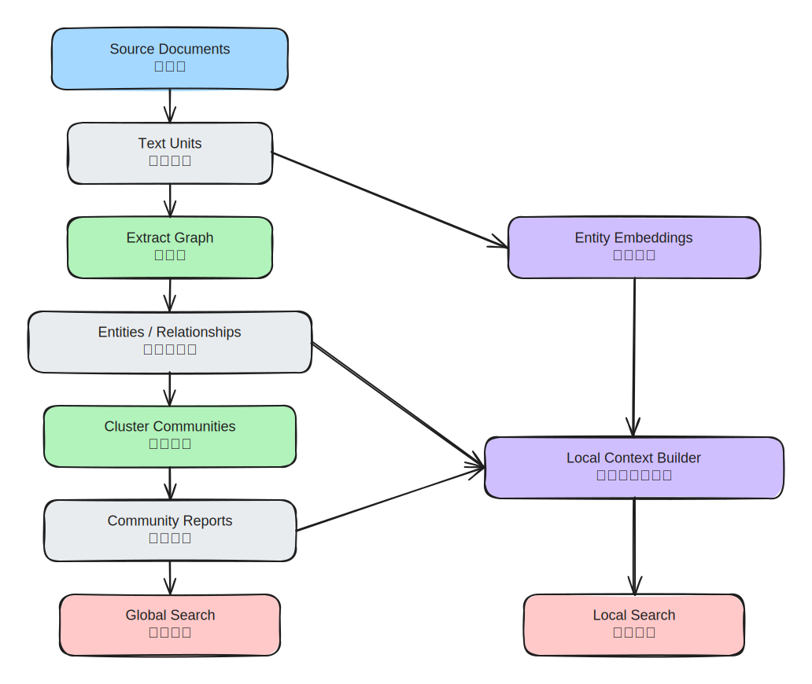
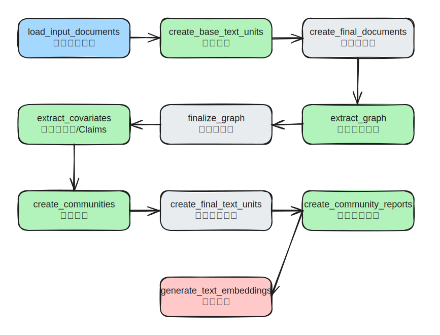
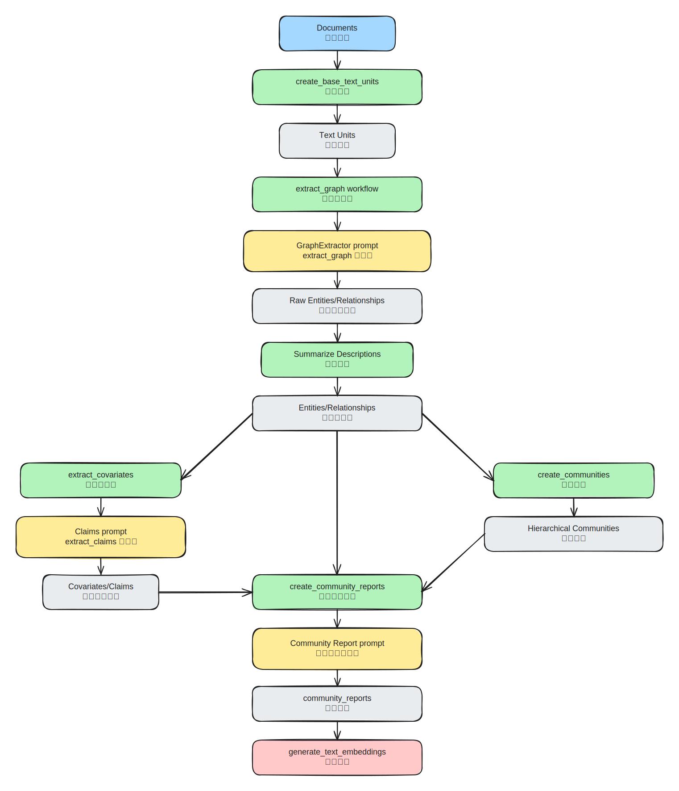
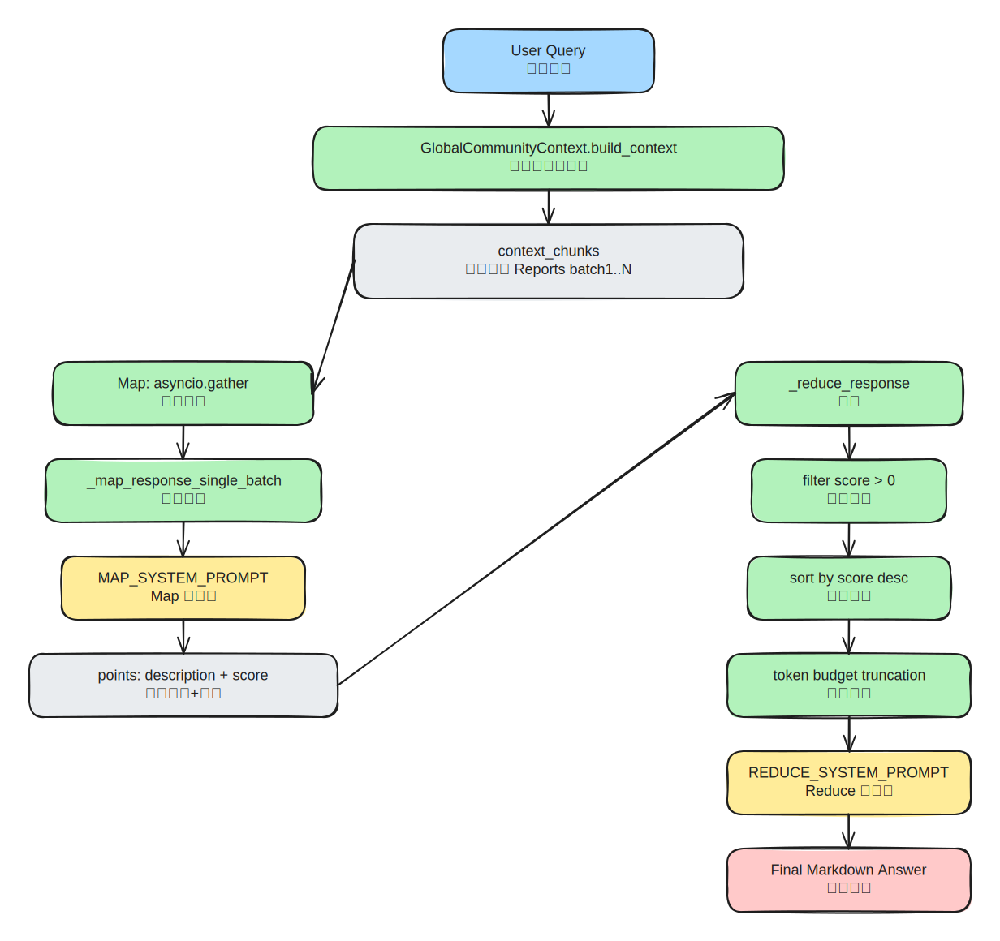
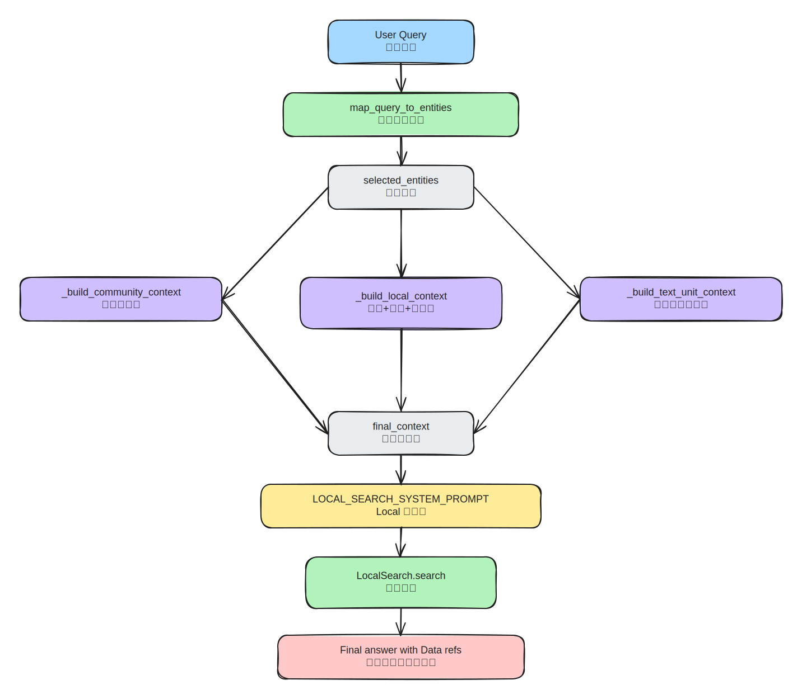

# GraphRAG 学习笔记

本文基于以下两部分整理：

- 论文：`From Local to Global: A Graph RAG Approach to Query-Focused Summarization`（arXiv:2404.16130）


全文统一使用一个小说案例：`《西历2236》`。

## 0. 贯穿案例设定

数据集（示意）：

1. 第 12 章：四叶和 Haru 在图书馆发生第一次关键冲突。
2. 第 34 章：四叶告白并说出“我喜欢的其实是被爱着的自己”。
3. 第 57 章：Haru 以“いいよ”回应，关系进入和解阶段。
4. 第 78 章：伸司揭露旧事件，关系再次波动。

我们关心两类问题：

- Global：`《西历2236》的核心母题与阶段性变化是什么？`
- Local：`四叶第一次明确向 Haru 表白发生在哪一章？`

## 1. 总体架构



这一层先回答三个问题：

1. 它先把什么数据准备好？
2. 它为什么不直接把原文喂给 LLM？
3. Global / Local 两条检索链路分别依赖哪部分数据？

---
1. `Index`：把原文变成“结构化图谱 + 社区报告 + 向量索引”。
2. `Global Search`：面向“全局主题问题”，在社区报告上做 Map-Reduce 汇总。
3. `Local Search`：面向“细节定位问题”，围绕实体邻域拼上下文做回答。

### 1.1 每一步在做什么，为什么要这么做

| 步骤 | 核心产物 | 作用（做什么） | 原因（为什么这样做） | 《西历2236》具体例子 |
|---|---|---|---|---|
| Source Documents | 原始章节文本 | 输入语料 | 没有结构化处理前，信息分散且冗长 | 第 12/34/57/78 章的原文段落 |
| Text Units | 切片后的 chunk | 把长文拆成可并行处理的最小单元 | 规避上下文窗口限制，提升抽取召回与并发效率 | 第 34 章被切成 `tu_34_1`、`tu_34_2` |
| Extract Graph | 实体/关系候选 | 从 chunk 中抽实体、关系、描述 | 把“自然语言”变成“可计算结构” | 从告白段落抽到“四叶 -> Haru（告白）” |
| Entities / Relationships | 归一后的图 | 合并同名实体、沉淀关系强度 | 支撑后续邻域扩展和社区划分 | “四叶”“Yotsuba”合并为同一实体节点 |
| Cluster Communities | 多层社区 | 将大图划成主题簇 | 全局问题不该遍历整图，先分主题再汇总更省 token | “情感告白线”“旧事件揭露线”分成两个社区 |
| Community Reports | 社区报告 | 把每个社区压缩成可引用摘要 | 给 Global Search 提供高密度证据块 | 报告写出“第 34 章转折、第 57 章和解”并带引用 |
| Entity Embeddings | 实体向量索引 | 支撑 query -> entity 映射 | Local Search 需要先找到“问题在说谁” | 问“谁先表白”时先命中“四叶/Haru” |
| Local Context Builder | 局部上下文窗口 | 拼接实体邻域、关系、相关文本单元 | 细节问答需要高相关、可追溯的局部证据 | 组合“实体关系 + 第 34 章片段 + claims”形成回答上下文 |

### 1.2 如果跳过某一步会怎样

1. 不做 `Text Units`：长文本直接抽取，漏信息和成本都会上升。
2. 不做 `Communities + Reports`：Global 问题会退化成“全文硬检索 + 长上下文拼接”，效果不稳定。
3. 不做 `Entity Embeddings`：Local 问题难以稳定命中正确实体，容易答非所问。

### 1.3 以《西历2236》为例

1. Global 问题：`《西历2236》的核心母题与阶段变化是什么？`
2. 系统优先读取 `Community Reports`，而不是逐章扫描全部正文。
3. Local 问题：`四叶第一次明确向 Haru 表白发生在哪一章？`
4. 系统先把 query 映射到“四叶/Haru”实体，再沿关系与文本单元回溯到第 34 章证据。

### 1.4 关键概念全覆盖

| 概念/做法 | 是什么 | 为什么 | 怎么做（在 GraphRAG 里） | 《西历2236》具体例子 |
|---|---|---|---|---|
| Text Unit | 文本切片后的最小处理单元 | 长文不能直接稳定抽取；要并发、可控、可追踪 | `create_base_text_units` 按 chunk 策略切分并写入 `text_units` | 第 57 章和解段被拆成多个 `tu_57_*` |
| Chunking | 把文档按 token 窗口分块 | 控制上下文长度，降低漏召回 | `create_chunker` + tokenizer；每块记录 `n_tokens` | 告白前后长对话被切成两个相邻 chunk |
| 稳定 ID | 基于内容生成可复现 id | 去重、关联、增量更新更稳定 | 对 chunk 内容做 hash（如 `gen_sha512_hash`） | 同一段文本重复导入仍映射到同一 ID |
| Extract Graph | 从文本抽实体/关系/描述 | 非结构化文本要转成图结构才能做邻域与社区推理 | `extract_graph` 工作流并发调用 LLM，输出实体关系表 | 抽到“伸司 -> 四叶（揭露旧事件）” |
| Gleanings | 多轮补抽机制 | 一轮抽取可能漏信息 | 通过 `max_gleanings` 控制追加抽取轮次 | 第一轮漏掉“图书馆冲突”，第二轮补回 |
| Description Summarization | 对冗长实体/关系描述做摘要归并 | 降低噪声和 token 消耗，保留主干语义 | 在抽图后用摘要模型合并描述字段 | 多段“四叶心理变化”压缩为一条摘要描述 |
| Covariates / Claims | 与实体相关的结构化断言 | Global/Local 都需要“可引用事实”而非纯文本印象 | `extract_covariates` 生成 claims/covariates 表 | claim: “第 34 章发生明确告白” |
| Knowledge Graph Finalize | 图结构规整和一致化 | 原始抽取结果可能有重复、冲突、别名 | `finalize_graph` 统一实体和关系表示 | “Haru/春”被归一成同一实体 |
| Community Detection | 对图做层次化社区划分 | 全局问题不能每次扫全图 | `create_communities`（常用 Leiden 思路）得到分层社区 | 告白线和旧事件线被分到不同社区 |
| Community Report | 每个社区的结构化摘要 | 给 Global Search 提供“高密度可汇总证据块” | `create_community_reports` 按固定 JSON 结构生成 | 报告写出“冲突 -> 告白 -> 和解 -> 再波动” |
| Grounding 引用 | 结论绑定数据来源 `[Data: ...]` | 防止“看起来合理但不可验证”的回答 | Prompt 约束每条结论必须带引用，限制引用数量 | “第 57 章和解”后带 `Reports (57)` |
| Text Embeddings | 文本/实体向量索引 | Local 先定位“问题在说谁、说哪段” | `generate_text_embeddings` 写入向量存储 | 问“告白章节”时召回与告白语句相近片段 |
| Query -> Entities 映射 | 把用户问题映射到候选实体 | Local 检索的入口 | `map_query_to_entities` 用 embedding 相似度召回 | 查询命中“四叶、Haru”，不命中无关角色 |
| Local Context Builder | 局部上下文拼装器 | 细节问答需要“相关且可追溯”的小窗口证据 | 合并社区片段、实体关系、text units 三类上下文 | 回答前组装“告白线社区 + 第34章文本 + 关系边” |
| Token Budget 分配 | 给不同上下文类型分配 token | 防止某一类证据挤占全部窗口 | `community_prop`/`text_unit_prop`/剩余给 local context | 细节问题把 `text_unit_prop` 提高到 0.5+ |
| In-network 优先 | 关系筛选先看实体内部连接 | 直接邻域更高相关、更低噪声 | `_filter_relationships` 先 in-network 再 out-network | 先保留“四叶-Haru”边，再考虑外围人物边 |
| Global Map 阶段 | 对社区报告分批并行分析 | 扩展覆盖面，避免单次上下文过载 | `asyncio.gather` + `MAP_SYSTEM_PROMPT` 产出 `points+score` | 各批次分别总结“母题、转折、冲突来源” |
| Global Reduce 阶段 | 合并 map 输出得到最终答案 | 需要统一观点并控 token | 过滤低分、按分排序、截断后用 `REDUCE_SYSTEM_PROMPT` 汇总 | 最终输出三条主母题并保留报告引用 |
| JSON 强约束输出 | 让模型返回结构化对象 | 便于程序解析、排序、过滤和追踪 | 调用时设置 `response_format_json_object=True` | map 输出标准化为 `points[{description,score}]` |
| Streaming Completion | 流式生成最终回答 | 降低交互等待感，支持长答案渐进输出 | Local/Search 侧使用 `stream=True` 完成生成 | 用户先看到“第34章告白”主结论，再补证据 |
| Prompt 分层设计 | Index/Global/Local 各自独立提示词 | 任务目标不同，不能一个 prompt 包打天下 | `prompts/index/*`、`prompts/query/*` 分场景维护 | 抽图 prompt 抽结构，Global prompt 做汇总 |
| Map-Reduce 思路 | 先分治再汇总的检索回答策略 | 处理大规模语料时更稳、更可扩展 | Global Search：Map 产观点，Reduce 产最终报告 | 先按社区并行分析，再统一给出全书母题 |

## 2. Index 阶段（构图与社区报告）

### 2.1 Index 全流程图



`_standard_workflows` 对应源码：`index/workflows/factory.py`。

---

### 2.2 步骤 1：文本分块 `create_base_text_units`

#### 原理

- 流式读 `documents`。
- chunker 切片。
- 对每个 chunk 计算 token 数和稳定 id。
- 逐行写入 `text_units`。

#### 源码函数

文件：`packages/graphrag/graphrag/index/workflows/create_base_text_units.py`

```python
async def run_workflow(config, context):
    # 1) 初始化 tokenizer 与 chunker
    tokenizer = get_tokenizer(encoding_model=config.chunking.encoding_model)
    chunker = create_chunker(config.chunking, tokenizer.encode, tokenizer.decode)

    # 2) 打开输入输出表
    async with (
        context.output_table_provider.open("documents") as documents_table,
        context.output_table_provider.open("text_units") as text_units_table,
    ):
        total_rows = await documents_table.length()
        sample_rows = await create_base_text_units(
            documents_table,
            text_units_table,
            total_rows,
            context.callbacks,
            tokenizer=tokenizer,
            chunker=chunker,
            prepend_metadata=config.chunking.prepend_metadata,
        )

    return WorkflowFunctionOutput(result=sample_rows)


async def create_base_text_units(
    documents_table,
    text_units_table,
    total_rows,
    callbacks,
    tokenizer,
    chunker,
    prepend_metadata=None,
):
    tick = progress_ticker(callbacks.progress, total_rows)
    sample_rows = []

    # 3) 流式遍历文档，避免一次性加载
    async for doc in documents_table:
        chunks = chunk_document(doc, chunker, prepend_metadata)
        for chunk_text in chunks:
            if chunk_text is None:
                continue

            # 4) 构建 text_unit 行
            row = {
                "id": "",
                "document_id": doc["id"],
                "text": chunk_text,
                "n_tokens": len(tokenizer.encode(chunk_text)),
            }
            row["id"] = gen_sha512_hash(row, ["text"])
            await text_units_table.write(row)

            if len(sample_rows) < 5:
                sample_rows.append(row)

        tick()

    return sample_rows
```

#### 贯穿案例数据流

输入（documents）：

| id | title | text | 例子说明 |
|---|---|---|---|
| doc_34 | 第34章 | 四叶对 Haru 的告白段落... | 这是后续“告白节点”最关键输入文档 |

输出（text_units）：

| id | document_id | text | n_tokens | 例子说明 |
|---|---|---|---|---|
| tu_34_1 | doc_34 | 四叶... | 581 | 更偏“四叶自白”语义，常命中角色心理问题 |
| tu_34_2 | doc_34 | Haru... | 597 | 更偏“Haru回应”语义，常命中关系结果问题 |

---

### 2.3 步骤 2：实体关系抽取 `extract_graph`

#### 原理

- 每个 text unit 独立调用 LLM 抽实体/关系。
- 再做跨 chunk 聚合。
- 可通过 `max_gleanings` 多轮补抽，提升召回。

#### 源码函数

文件：`packages/graphrag/graphrag/index/workflows/extract_graph.py`

```python
async def run_workflow(config, context):
    text_units = await DataReader(context.output_table_provider).text_units()

    # 1) 抽取模型 + prompt
    extraction_model = create_completion(...)
    extraction_prompt = config.extract_graph.resolved_prompts().extraction_prompt

    # 2) 摘要模型（用于描述归并摘要）
    summarization_model = create_completion(...)
    summarization_prompt = config.summarize_descriptions.resolved_prompts().summarize_prompt

    entities, relationships, raw_entities, raw_relationships = await extract_graph(
        text_units=text_units,
        callbacks=context.callbacks,
        extraction_model=extraction_model,
        extraction_prompt=extraction_prompt,
        entity_types=config.extract_graph.entity_types,
        max_gleanings=config.extract_graph.max_gleanings,
        extraction_num_threads=config.concurrent_requests,
        extraction_async_type=config.async_mode,
        summarization_model=summarization_model,
        max_summary_length=config.summarize_descriptions.max_length,
        max_input_tokens=config.summarize_descriptions.max_input_tokens,
        summarization_prompt=summarization_prompt,
        summarization_num_threads=config.concurrent_requests,
    )

    await context.output_table_provider.write_dataframe("entities", entities)
    await context.output_table_provider.write_dataframe("relationships", relationships)
```

文件：`packages/graphrag/graphrag/index/operations/extract_graph/graph_extractor.py`

```python
async def _process_document(self, text, entity_types):
    # 1) 首轮抽取
    messages_builder = CompletionMessagesBuilder().add_user_message(
        self._extraction_prompt.format(input_text=text, entity_types=",".join(entity_types))
    )
    response = await self._model.completion_async(messages=messages_builder.build())
    results = response.content
    messages_builder.add_assistant_message(results)

    # 2) 追加抽取（gleaning）
    if self._max_gleanings > 0:
        for i in range(self._max_gleanings):
            messages_builder.add_user_message(CONTINUE_PROMPT)
            more = await self._model.completion_async(messages=messages_builder.build())
            results += more.content
            messages_builder.add_assistant_message(more.content)

            if i >= self._max_gleanings - 1:
                break

            messages_builder.add_user_message(LOOP_PROMPT)
            flag = await self._model.completion_async(messages=messages_builder.build())
            if flag.content != "Y":
                break

    return results
```

#### Prompt 拆解（Index-Extract Graph）

源码：

```text
-Goal-
Given a text document ... identify all entities of those types from the text and all relationships among the identified entities.

1. Identify all entities ...
Format each entity as ("entity"<|><entity_name><|><entity_type><|><entity_description>)

2. ... identify all pairs ... that are *clearly related* ...
Format each relationship as ("relationship"<|><source_entity><|><target_entity><|><relationship_description><|><relationship_strength>)

3. Return output in English as a single list ...
Use **##** as the list delimiter.

4. When finished, output <|COMPLETE|>
```

中文翻译：

```text
目标：
给定一段可能与任务相关的文本，以及一组实体类型，找出文本里属于这些类型的全部实体，
以及这些实体之间的全部关系。

步骤 1：
识别所有实体，并按固定协议输出：
("entity"<|>实体名<|>实体类型<|>实体描述)

步骤 2：
只在“关系明确成立”的实体对之间抽关系，并按固定协议输出：
("relationship"<|>源实体<|>目标实体<|>关系描述<|>关系强度)

步骤 3：
把所有实体和关系串成一个列表，条目之间用 ## 分隔。

步骤 4：
结束时必须输出 <|COMPLETE|>。
```

解析：

1. 这一段不是在让模型“写解释”，而是在让模型“吐协议”。GraphRAG 首先要的是可解析中间件，不是自然语言答案。
2. `clearly related` 是一个很关键的收缩条件。它在主动压制模型把弱相关、常识相关、联想相关都连成边。
3. `entity_description` 和 `relationship_description` 要写全，是为了给后面的 description summarization、community report、local context 保留语义密度。
4. `##` 和 `<|COMPLETE|>` 是协议边界，不是语气词。后续补抽与 parser 都依赖这个边界。
5. `CONTINUE_PROMPT + LOOP_PROMPT` 的设计，等于承认“一次抽取天然会漏”，所以 GraphRAG 把抽图做成了“粗抽 + 追问补抽”的召回流程。
6. 这段 prompt 常见失败点有两个：
- `entity_types` 太窄，模型即使看到了也不能输出。
- chunk 切得太碎，实体和关系落在不同块里，边会天然变少。
7. 所以抽图 prompt 的本质不是“让模型聪明一点”，而是“把抽取任务变成可控、可补抽、可解析的结构化协议”。

#### 贯穿案例示例

输入 chunk（第 34 章片段）：

```text
四叶对 Haru 说，她一直以为自己喜欢 Haru，但真正执着的是“被爱的自己”。
```

抽取结果（示意）：

- Entity：`四叶(PERSON)`、`HARU(PERSON)`、`告白场景(EVENT)`
- Relationship：
  - `四叶 -> Haru（告白对象）`
  - `四叶 -> 告白场景（参与）`

---

### 2.4 步骤 3：声明抽取 `extract_covariates`（Claims）

#### 原理

这一步补“事实断言层”，不是图结构层。

- 图结构回答“谁和谁有关”。
- Claims 回答“这个实体发生了什么事实、何时、证据是什么”。

#### Prompt 拆解（Index-Extract Claims）

源码：

```text
2. For each entity identified in step 1, extract all claims associated with the entity.

- Subject ...
- Object ...
- Claim Type ...
- Claim Status: TRUE / FALSE / SUSPECTED
- Claim Description ...
- Claim Date ...
- Claim Source Text: List of all quotes ...

Format each claim as
(<subject_entity><|><object_entity><|><claim_type><|><claim_status><|><claim_start_date><|><claim_end_date><|><claim_description><|><claim_source>)
```

中文翻译：

```text
对每个命中的实体，继续抽取与它相关的 claim。

每条 claim 至少要给出：
- 主体：谁发起了这个动作或承担这个事实
- 客体：影响到了谁；不知道就填 NONE
- claim 类型：要能跨文本复用，不能每段话都起新名字
- claim 状态：已确认 / 已证伪 / 仅怀疑
- claim 描述：把推理和证据都写进去
- claim 时间：起止时间都要给，且用 ISO-8601
- claim 原文证据：相关引文要尽量全带上

输出时仍然走固定元组协议。
```

解析：

1. 这一步和抽图的区别在于：抽图关心“谁和谁相连”，claims 关心“到底发生了什么、证据是什么、是否成立”。
2. `Claim Status` 很重要，它强迫模型区分“真实发生”“被否定”“只是怀疑”，这会直接影响后续回答的可信度。
3. `Claim Type` 被要求能跨文本复用，本质是在约束标签空间，避免同类事实在不同 chunk 里被命名成完全不同的类别。
4. `Claim Date` 强制双时间边界，是为了把时间不确定性也结构化存下来，而不是只留一句模糊叙述。
5. `Claim Source Text` 要尽量带全相关引文，说明 claim 不是普通摘要，而是“带证据的结构化断言”。
6. 这一步很依赖 prompt tuning。因为“什么样的事实值得抽成 claim”，在风控、法律、文学分析里完全不是一回事。
7. 对你的小说案例来说：
- relationship 会说“四叶和 Haru 存在告白关系”
- claim 会说“第 34 章发生了明确自我承认，状态 TRUE，证据在原句里”

#### 贯穿案例示例

```text
(四叶<|>Haru<|>SELF_RECOGNITION<|>TRUE<|>2236-03-14T00:00:00<|>2236-03-14T00:00:00<|>四叶承认执着的是被爱幻象<|>“好きだったのは...”)
```

---

### 2.5 步骤 4：社区检测 `create_communities`

#### 原理

在关系图上做层次 Leiden：

- `level` 越高越抽象。
- 生成 `community / parent / children` 树结构。

#### 源码函数

文件：`packages/graphrag/graphrag/index/workflows/create_communities.py`

```python
async def create_communities(
    communities_table,
    entities_table,
    relationships,
    max_cluster_size,
    use_lcc,
    seed=None,
):
    # 1) 图聚类
    clusters = cluster_graph(relationships, max_cluster_size, use_lcc, seed=seed)

    # 2) title -> entity_id 映射
    title_to_entity_id = {}
    async for row in entities_table:
        title_to_entity_id[row["title"]] = row["id"]

    # 3) cluster 展平并聚合 entity_ids
    communities = pd.DataFrame(clusters, columns=["level", "community", "parent", "title"]).explode("title")
    entity_map = communities[["community", "title"]].copy()
    entity_map["entity_id"] = entity_map["title"].map(title_to_entity_id)
    entity_ids = entity_map.dropna(subset=["entity_id"]).groupby("community").agg(entity_ids=("entity_id", list)).reset_index()

    # 4) 逐层聚合关系和 text units（只保留社区内边）
    level_results = []
    for level in communities["level"].unique():
        ...

    # 5) 组装最终 communities 记录并写入表
    final_communities = all_grouped.merge(entity_ids, on="community", how="inner")
    final_communities["children"] = ...
    for row in final_communities.to_dict("records"):
        await communities_table.write(_sanitize_row(row))
```

#### 贯穿案例示例

可能聚出：

1. `Community 3`：四叶-Haru 情感主线
2. `Community 7`：伸司调查线
3. `Community 1`（父级）：主线冲突总社区

---

### 2.6 步骤 5：社区报告 `create_community_reports`

#### 原理

- 先把每个社区上下文组织好（实体、关系、claims）。
- 再按层级生成报告（从低层到高层）。
- 输出结构化 community reports，供 Global Search 消费。

#### 源码函数

文件：`packages/graphrag/graphrag/index/workflows/create_community_reports.py`

```python
async def create_community_reports(
    relationships,
    entities,
    communities,
    claims_input,
    callbacks,
    model,
    tokenizer,
    prompt,
    max_input_length,
    max_report_length,
    num_threads,
    async_type,
):
    # 1) 展开 community 节点
    nodes = explode_communities(communities, entities)
    nodes = _prep_nodes(nodes)
    edges = _prep_edges(relationships)
    claims = _prep_claims(claims_input) if claims_input is not None else None

    # 2) 构建本地上下文
    local_contexts = build_local_context(nodes, edges, claims, tokenizer, callbacks, max_input_length)

    # 3) 分层 summarize
    community_reports = await summarize_communities(
        nodes,
        communities,
        local_contexts,
        build_level_context,
        callbacks,
        model=model,
        prompt=prompt,
        tokenizer=tokenizer,
        max_input_length=max_input_length,
        max_report_length=max_report_length,
        num_threads=num_threads,
        async_type=async_type,
    )

    return finalize_community_reports(community_reports, communities)
```

文件：`packages/graphrag/graphrag/index/operations/summarize_communities/summarize_communities.py`

```python
async def summarize_communities(...):
    reports = []
    levels = get_levels(nodes)

    # 1) 为每个层级构建 context
    level_contexts = []
    for level in levels:
        level_context = level_context_builder(..., level=level, max_context_tokens=max_input_length)
        level_contexts.append(level_context)

    # 2) 每层并发生成报告
    for i, level_context in enumerate(level_contexts):
        local_reports = await derive_from_rows(level_context, run_generate, ...)
        reports.extend([lr for lr in local_reports if lr is not None])

    return pd.DataFrame(reports)
```

#### Prompt 拆解（Index-Community Report）

源码：

```text
# Goal
Write a comprehensive report of a community ...

- TITLE
- SUMMARY
- IMPACT SEVERITY RATING
- RATING EXPLANATION
- DETAILED FINDINGS

Return output as a well-formed JSON-formatted string ...

# Grounding Rules
Points supported by data should list their data references ...
Do not include information where the supporting evidence for it is not provided.
Limit the total report length to {max_report_length} words.
```

中文翻译：

```text
目标：
给定某个社区里的实体、关系、以及可选 claims，写一份完整的社区报告。

报告结构固定为：
- 标题
- 摘要
- 影响评分
- 评分解释
- 详细发现

输出必须是可解析的 JSON。
所有结论都要带数据引用；没有证据就不要写。
整个报告还要受字数上限约束。
```

解析：

1. 这段 prompt 做的不是最终问答，而是把一个社区压成“后续可消费的知识块”。
2. 它强制 JSON 输出，说明 community report 从设计上就是中间产物，不是给人随便看的散文。
3. `rating` 看起来像附属字段，实际上会影响后续 Global Search 对社区重要性的判断。
4. `findings` 不是一句话 bullet，而是“短标题 + 多段解释”，这让它很适合继续被 Map 阶段再压缩。
5. grounding 规则被反复强调，说明这一层最怕的不是“不优雅”，而是“写出脱离数据的结论”。
6. 如果从整条链路看：
- extract_graph / extract_claims 负责把原文变成结构化数据
- community_report 负责第一次把结构化数据重新翻译回自然语言
7. 所以 community report 是 Index 和 Query 的接口层。这里写得不扎实，后面的 Global Map/Reduce 再强也只能在低质量中间件上做总结。

#### 贯穿案例示例（community report）

```json
{
  "title": "四叶与 Haru 的告白线",
  "summary": "该社区围绕第34章告白与第57章和解展开...",
  "rating": 9.0,
  "rating_explanation": "该社区决定了主线情感母题。",
  "findings": [
    {
      "summary": "四叶的自我识别转折",
      "explanation": "... [Data: Entities (101, 102); Claims (45, +more)]"
    }
  ]
}
```

---

### 2.7 Index 阶段详细流程图（含 prompt）



## 3. Global Search（全局搜索）

### 3.1 适用问题

适合：

1. 全书主题归纳
2. 多条剧情线横向对比
3. 跨社区的因果总结

不适合：

1. 精确章节定位
2. 单实体事实核对

### 3.2 Global 详细流程图



### 3.3 核心函数
文件：`query/structured_search/global_search/search.py`

```python
async def search(self, query, conversation_history=None, **kwargs):
    # 1) 构建社区上下文（分 batch）
    context_result = await self.context_builder.build_context(
        query=query,
        conversation_history=conversation_history,
        **self.context_builder_params,
    )

    # 2) Map：对每个 batch 并行调用 LLM
    map_responses = await asyncio.gather(*[
        self._map_response_single_batch(
            context_data=data,
            query=query,
            max_length=self.map_max_length,
            **self.map_llm_params,
        )
        for data in context_result.context_chunks
    ])

    # 3) Reduce：汇总 map 结果
    reduce_response = await self._reduce_response(
        map_responses=map_responses,
        query=query,
        **self.reduce_llm_params,
    )

    return GlobalSearchResult(
        response=reduce_response.response,
        context_data=context_result.context_records,
        context_text=context_result.context_chunks,
        map_responses=map_responses,
        reduce_context_data=reduce_response.context_data,
        reduce_context_text=reduce_response.context_text,
        ...
    )


async def _map_response_single_batch(self, context_data, query, max_length, **llm_kwargs):
    # A) 组装 map prompt
    search_prompt = self.map_system_prompt.format(context_data=context_data, max_length=max_length)

    # B) 强制 JSON 输出
    model_response = await self.model.completion_async(
        messages=CompletionMessagesBuilder().add_system_message(search_prompt).add_user_message(query).build(),
        response_format_json_object=True,
        **llm_kwargs,
    )

    # C) 解析 points -> [{answer, score}, ...]
    search_response = await gather_completion_response_async(model_response)
    processed_response = self._parse_search_response(search_response)
    return SearchResult(response=processed_response, ...)


async def _reduce_response(self, map_responses, query, **llm_kwargs):
    # A) 收集所有 map key points
    key_points = []
    for index, response in enumerate(map_responses):
        ...

    # B) 过滤 score=0 + 排序
    filtered_key_points = [p for p in key_points if p["score"] > 0]
    filtered_key_points = sorted(filtered_key_points, key=lambda x: x["score"], reverse=True)

    # C) token 预算截断
    data, total_tokens = [], 0
    for point in filtered_key_points:
        formatted = f"----Analyst {point['analyst'] + 1}----\nImportance Score: {point['score']}\n{point['answer']}"
        if total_tokens + len(self.tokenizer.encode(formatted)) > self.max_data_tokens:
            break
        data.append(formatted)
        total_tokens += len(self.tokenizer.encode(formatted))

    # D) Reduce prompt 统一生成
    search_prompt = self.reduce_system_prompt.format(
        report_data="\n\n".join(data),
        response_type=self.response_type,
        max_length=self.reduce_max_length,
    )
    ...
```

### 3.4 Prompt 拆解（Global）

#### Map Prompt

源码：

```text
Generate a response consisting of a list of key points ...

Each key point:
- Description
- Importance Score: 0-100

The response should be JSON formatted as:
{
  "points": [
    {"description": "... [Data: Reports (...)]", "score": score_value}
  ]
}

Do not include information where the supporting evidence for it is not provided.
```

中文翻译：

```text
请基于当前这批社区报告，先产出若干“关键点”。

每个关键点都要有：
- 描述
- 重要度分数（0 到 100）

输出必须是 JSON。
如果数据里没有足够证据，就直接说不知道，不要编。
```

解析：

1. Map 阶段不是直接回答用户，而是先把“每个批次的局部洞察”压成结构化观点。
2. `score` 的作用很像局部重排序信号，它告诉后面的 Reduce：哪些点更值得保留。
3. Map 结果仍然保留 `[Data: Reports (...)]`，说明 Reduce 不是重新找证据，而是消费带引用的半成品。
4. 它要求 JSON 而不是 markdown，进一步说明 Map 是分析中间件，不是最终文案层。
5. Map prompt 过松时，常见问题有两个：
- 点太泛，全是套话，Reduce 无法筛选
- 点太碎，全是局部细节，Reduce 很难重组成结构化主题
6. 所以 Map 的真正目标不是“总结”，而是“把批次级证据压成可排序的观点列表”。

#### Reduce Prompt

源码：

```text
Generate a response ... by synthesizing perspectives from multiple analysts.

The analysts' reports are ranked in descending order of importance.
The final response should remove irrelevant information and merge the cleaned information into a comprehensive answer.
The response should preserve all the data references ...
do not mention the roles of multiple analysts ...
Style the response in markdown.
```

中文翻译：

```text
请把多个分析结果合并成最终答案。

这些分析结果已经按重要度降序排好。
你要删除无关信息、合并重复点、保留所有原有引用，
但不要在最终答案里暴露“这是多个分析师产出的结果”。
输出使用 markdown。
```

解析：

1. Reduce 的本质不是“再分析一次”，而是“压缩、去重、重组 Map 的结果”。
2. 它明确假设 analyst reports 已按重要度排序，说明排序工作在 Reduce 之前就做完了。
3. 它要求“保留所有 data references”，这一点非常关键。否则最终答案一旦丢引用，整条 grounding 链就断了。
4. “不要提多个分析师角色”是在做产品层去痕迹。内部是多批次、多视角；对外必须像一个统一答案。
5. 所以 Global Search 的 prompt 分工非常清楚：
- Map 负责从批次里挖观点
- Reduce 负责把观点拼成可读结论
6. 如果 Global 效果差，很多时候问题不在 Reduce，而在 Map 阶段产出的 points 质量就不够。

### 3.5 贯穿案例（Global）

查询：`《西历2236》的核心母题与阶段变化是什么？`

Map 可能输出（简化）：

```json
{
  "points": [
    {"description": "四叶在第34章完成自我识别转折 [Data: Reports (12, 34)]", "score": 95},
    {"description": "第57章关系和解将主题从自我执着推进到共情 [Data: Reports (57)]", "score": 88}
  ]
}
```

Reduce 最终答案：

- 母题 1：自我幻象的剥离
- 母题 2：关系中的承认与包容
- 母题 3：外部冲突对内在关系的反复施压

并附 `Reports` 引用。

## 4. Local Search（局部搜索）

### 4.1 适用问题

适合：

1. 章节定位
2. 某角色与某角色关系解释
3. 某事件直接证据回溯

### 4.2 Local 详细流程图



### 4.3 核心函数

文件：`query/structured_search/local_search/mixed_context.py`

```python
def build_context(
    self,
    query,
    conversation_history=None,
    max_context_tokens=8000,
    text_unit_prop=0.5,
    community_prop=0.25,
    top_k_mapped_entities=10,
    top_k_relationships=10,
    ...,
):
    # 1) 校验预算比例
    if community_prop + text_unit_prop > 1:
        raise ValueError("The sum of community_prop and text_unit_prop should not exceed 1.")

    # 2) query -> entities
    selected_entities = map_query_to_entities(
        query=query,
        text_embedding_vectorstore=self.entity_text_embeddings,
        text_embedder=self.text_embedder,
        all_entities_dict=self.entities,
        k=top_k_mapped_entities,
        oversample_scaler=2,
        ...,
    )

    # 3) 分配 token 预算
    community_tokens = max(int(max_context_tokens * community_prop), 0)
    local_tokens = max(int(max_context_tokens * (1 - community_prop - text_unit_prop)), 0)
    text_unit_tokens = max(int(max_context_tokens * text_unit_prop), 0)

    # 4) 三类上下文拼装
    community_context, community_context_data = self._build_community_context(..., max_context_tokens=community_tokens)
    local_context, local_context_data = self._build_local_context(..., max_context_tokens=local_tokens, top_k_relationships=top_k_relationships)
    text_unit_context, text_unit_context_data = self._build_text_unit_context(..., max_context_tokens=text_unit_tokens)

    # 5) 合并为一个窗口
    final_context = "\n\n".join([community_context, local_context, text_unit_context]).strip()
    ...
    return ContextBuilderResult(context_chunks=final_context, context_records=final_context_data)
```

关系筛选关键函数（优先 in-network）：

文件：`query/context_builder/local_context.py`

```python
def _filter_relationships(selected_entities, relationships, top_k_relationships=10, relationship_ranking_attribute="rank"):
    in_network_relationships = get_in_network_relationships(...)
    out_network_relationships = get_out_network_relationships(...)

    # out-network 里优先“共享邻居”
    ...

    relationship_budget = top_k_relationships * len(selected_entities)
    return in_network_relationships + out_network_relationships[:relationship_budget]
```

最终调用：

文件：`query/structured_search/local_search/search.py`

```python
async def search(self, query, conversation_history=None, **kwargs):
    # 1) build context
    context_result = self.context_builder.build_context(
        query=query,
        conversation_history=conversation_history,
        **kwargs,
        **self.context_builder_params,
    )

    # 2) 填充 local prompt
    search_prompt = self.system_prompt.format(
        context_data=context_result.context_chunks,
        response_type=self.response_type,
    )

    # 3) 单轮流式生成
    response = await self.model.completion_async(
        messages=CompletionMessagesBuilder().add_system_message(search_prompt).add_user_message(query).build(),
        stream=True,
        **self.model_params,
    )
    ...
```

### 4.4 Prompt 拆解（Local）

源码：

```text
Generate a response ... summarizing all information in the input data tables ...
and incorporating any relevant general knowledge.

If you don't know the answer, just say so. Do not make anything up.

Points supported by data should list their data references as follows:
[Data: Sources (...); Reports (...); Entities (...); Relationships (...); Claims (...)]

Do not include information where the supporting evidence for it is not provided.
```

中文翻译：

```text
请基于给定的数据表回答用户问题，并按照目标长度和格式组织答案。

你可以补充相关的一般常识，
但如果不知道，就直接说不知道，不要编造。

所有由数据支持的结论，都要带上数据引用。
没有证据支持的信息，不要写进答案。
```

解析：

1. Local prompt 最值得注意的一句，其实是 `incorporating any relevant general knowledge`。这说明它允许模型用常识做组织和润色。
2. 但紧接着又收紧为 `Do not make anything up.`，于是形成一个张力：
- 可以用常识帮助解释
- 不能让常识替代证据
3. 这意味着理想的 Local 输出不是“只复述表格”，而是“用常识组织语言，但关键事实必须回指到 Sources / Relationships / Claims”。
4. 它的引用粒度比 Global 更细，说明 Local 的目标不是主题归纳，而是证据回溯。
5. 所以 Local 更适合回答：
- 第几章
- 谁先说了什么
- 某个关系到底靠什么证据成立
6. Local 效果差时，不能只怪 prompt。很多时候是前面的 context builder 没把正确的 text units、relationships、claims 塞进 prompt。

### 4.5 贯穿案例（Local）

查询：`四叶第一次明确向 Haru 表白发生在哪一章？`

Local context 组装后（示意）：

```text
-----Entities-----
id|entity|description|number of relationships
E101|四叶|主角，存在自我认知转折|15
E102|HARU|主要关系对象|12

-----Relationships-----
id|source|target|description|weight
R234|四叶|HARU|第34章明确告白|0.92

-----Sources-----
id|text
TU34_12|“四叶：我其实一直喜欢的是被你爱着的自己...”
```

输出（示意）：

`四叶第一次明确告白发生在第34章 [Data: Sources (TU34_12); Relationships (R234)]`。

---

### 4.6 Local 分步检查清单

1. `map_query_to_entities` 是否命中目标实体。
2. `top_k_relationships` 是否过小导致证据不够。
3. `text_unit_prop` 是否足够高（细节问题建议 >= 0.5）。
4. 最终答案是否含 `Sources` 证据引用。

## 5. Prompt 作为关键环节：统一总拆解

这里把 Index / Global / Local 的 prompt 设计逻辑放到同一张表。

| 阶段 | Prompt | 主要输入 | 主要输出 | 关键约束 | 《西历2236》具体例子 |
|---|---|---|---|---|---|
| Index-抽图 | `extract_graph` | text + entity_types | entity/relationship tuples | 格式化协议 + 完成标记 + 可补抽 | 从第 34 章文本抽出“四叶、Haru、告白关系” |
| Index-抽声明 | `extract_claims` | text + entity_specs + claim_description | claim tuples | status/date/source text 必填 | 生成 claim：“第34章发生明确告白，状态=已发生” |
| Index-社区报告 | `community_report` | entities + relationships + claims | JSON report | grounding 引用 + rating + findings | 生成“告白线社区报告”，包含章节引用 |
| Global-Map | `global_search_map_system_prompt` | reports batch | points JSON + score | 0-100 打分 + reports 引用 | 某批次输出“第57章和解推动主题转向共情（score=88）” |
| Global-Reduce | `global_search_reduce_system_prompt` | ranked analyst points | final markdown | 保留引用 + token 长度限制 | 汇总成“冲突-告白-和解-再波动”四阶段总结 |
| Local | `local_search_system_prompt` | mixed context tables | final markdown | 多数据源引用 + 禁止无证据输出 | 回答“首次告白在哪章”并给出第 34 章证据引用 |

## 6. Global vs Local：小说项目中的决策规则

| 维度 | Local Search | Global Search | 《西历2236》具体例子 |
|---|---|---|---|
| 问题类型 | 章节、台词、关系细节 | 主题、结构、阶段总结 | “第几章告白？”用 Local；“全书母题是什么？”用 Global |
| 数据来源 | 实体邻域 + 源文本 | 社区报告 | Local 读第 34 章片段；Global 读多社区报告 |
| 调用形态 | 单轮生成 | Map-Reduce 多轮 | Local 一次出答案；Global 先 map 再 reduce |
| 速度 | 快 | 慢 | 章节定位通常更快，全局主题归纳更慢 |
| 引用粒度 | Sources / Relationships 细粒度 | Reports 聚合粒度 | Local 引到 text unit；Global 引到 report id |

决策建议：

1. 先 Global 画“主题地图”。
2. 再 Local 钻“证据细节”。
3. 最后把两者合并成可解释结论。

## 7. 关键配置参数

```yaml
local_search:
  text_unit_prop: 0.5
  community_prop: 0.25
  conversation_history_max_turns: 5
  top_k_entities: 10
  top_k_relationships: 10
  max_context_tokens: 8000

global_search:
  max_context_tokens: 8000
  data_max_tokens: 12000
  map_max_length: 1000
  reduce_max_length: 2000
```

调优方向：

1. 章节定位不准：提高 `text_unit_prop`、`top_k_entities`。
2. 主题总结发散：降低 `map_max_length`，提高 reduce 约束。
3. 引用不足：检查索引阶段 claims 和 community_report 的 grounding 输出质量。

## 8. 自动生成 Prompt（Prompt Tuning）为什么也很关键

前面讲的都是运行时 prompt。但 GraphRAG 还有一层更上游：它会先根据你的语料，生成更适配的 prompt 模板。

### 8.1 它不是直接改答案 prompt，而是在先造 prompt 的上游条件

源码：

```python
if not domain:
    domain = await generate_domain(llm, doc_list)

if not language:
    language = await detect_language(llm, doc_list)

persona = await generate_persona(llm, domain)
community_report_ranking = await generate_community_report_rating(...)
entity_types = await generate_entity_types(...)
examples = await generate_entity_relationship_examples(...)

extract_graph_prompt = create_extract_graph_prompt(...)
entity_summarization_prompt = create_entity_summarization_prompt(...)
community_summarization_prompt = create_community_summarization_prompt(...)
```

中文翻译：

```text
如果你没有手工指定 domain 和 language，系统会先自动推断领域和语言，
再生成 persona、评分标准、实体类型、few-shot 示例，
最后才拼出真正用于索引阶段的 prompt。
```

解析：

1. 这说明 GraphRAG 不把 prompt 当静态文案，而是把 prompt 当“由数据驱动生成的配置产物”。
2. 它先生成 persona、rating description、entity types、examples，再去拼 extract graph / community summary prompt，本质是在做 prompt 的条件化。
3. 所以“原始 prompt 很重要”是对的，但还不够完整。更重要的是：
- 运行时 prompt 写了什么
- 这些 prompt 在进入运行时之前，是如何被上游模板塑形的

### 8.2 Persona Prompt

源码：

```text
Given a specific type of task and sample text, help the user by generating a 3 to 4 sentence description of an expert who could help solve the problem.
Use a format similar to:
You are an expert {role}. You are skilled at {relevant skills}. ...
```

中文翻译：

```text
给定任务类型和样本文本，生成一段 3 到 4 句的人设说明，
告诉模型“你现在应该扮演怎样的专家”。
```

解析：

1. persona 不是装饰性的语气，而是在给后续所有 prompt 定“观察视角”。
2. 如果 persona 偏新闻调查，模型会更关注事件、风险、影响。
3. 如果 persona 偏文学分析，模型会更关注主题、动机、象征。
4. 同一段文本，换一个 persona，后面的抽图重点和社区报告风格都可能变。

### 8.3 社区评分标准 Prompt

源码：

```text
Your goal is to provide a rating that reflects the relevance and significance of the text to the specified domain and persona.
Only respond with the text description of the importance criteria.
```

中文翻译：

```text
请根据 domain 和 persona，生成一段“什么样的文本算重要”的评分说明。
输出的不是分数，而是评分标准文本本身。
```

解析：

1. 这一步很容易被忽略，但它决定 community report 里的 `rating` 到底在衡量什么。
2. 如果评分标准偏“风险”，高分社区会变成风险社区。
3. 如果评分标准偏“叙事关键性”，高分社区会更接近主线转折社区。
4. 也就是说，rating 不是客观存在的，它是被 prompt 先定义出来的。

### 8.4 社区角色 Prompt

源码：

```text
Given a sample text, help the user by creating a role definition that will be tasked with community analysis.
...
The report will be used to inform decision-makers ...
```

中文翻译：

```text
请根据样本文本，为“社区分析报告撰写者”生成一个角色定义，
说明这个角色在看什么、为谁写、重点关心哪些信息。
```

解析：

1. 这一步是在给 community report prompt 注入“报告作者视角”。
2. 它决定社区报告更像技术分析、风控报告，还是文学评论。
3. 换句话说，community report 的写法并不是一开始就固定的，而是先被 role prompt 塑形。
