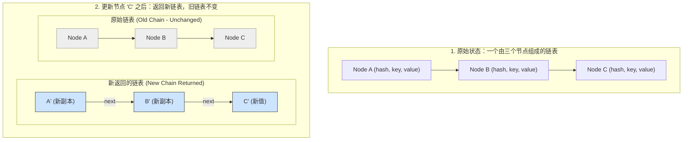
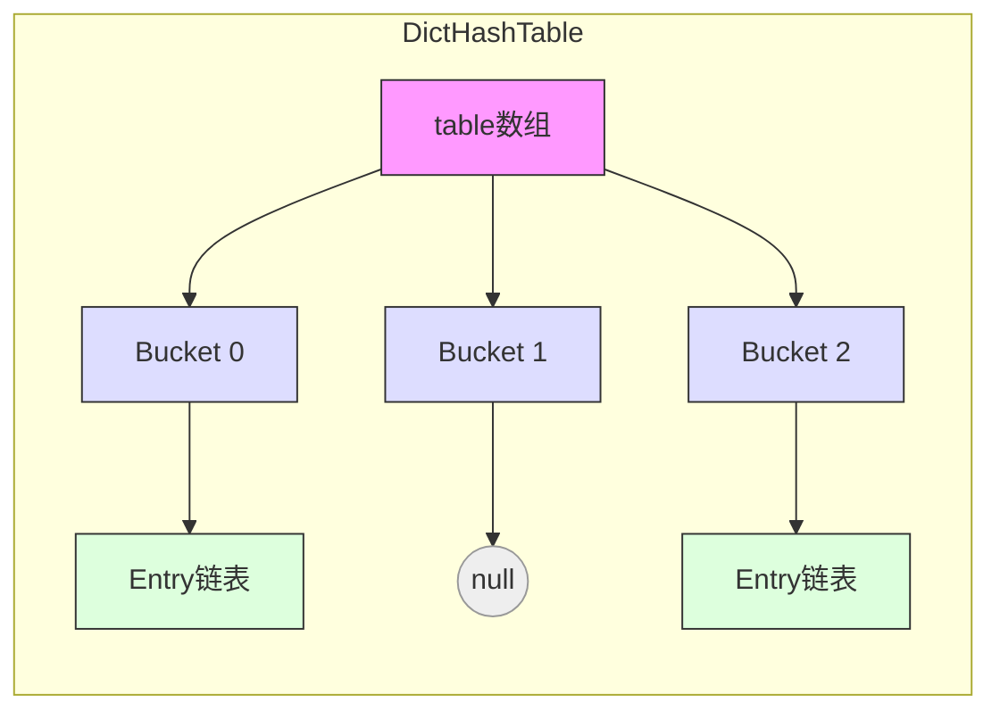
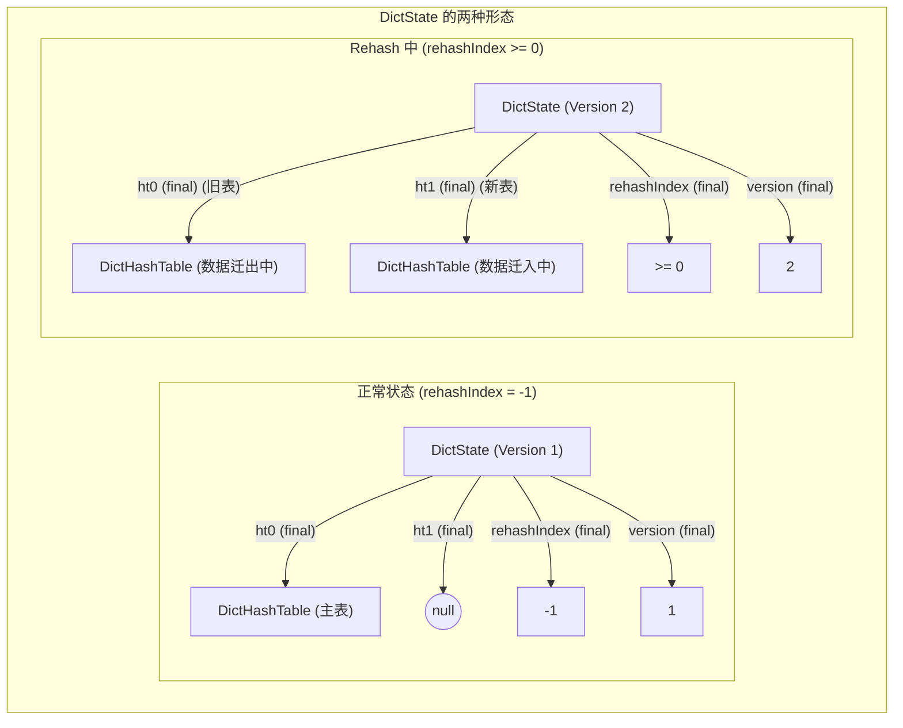
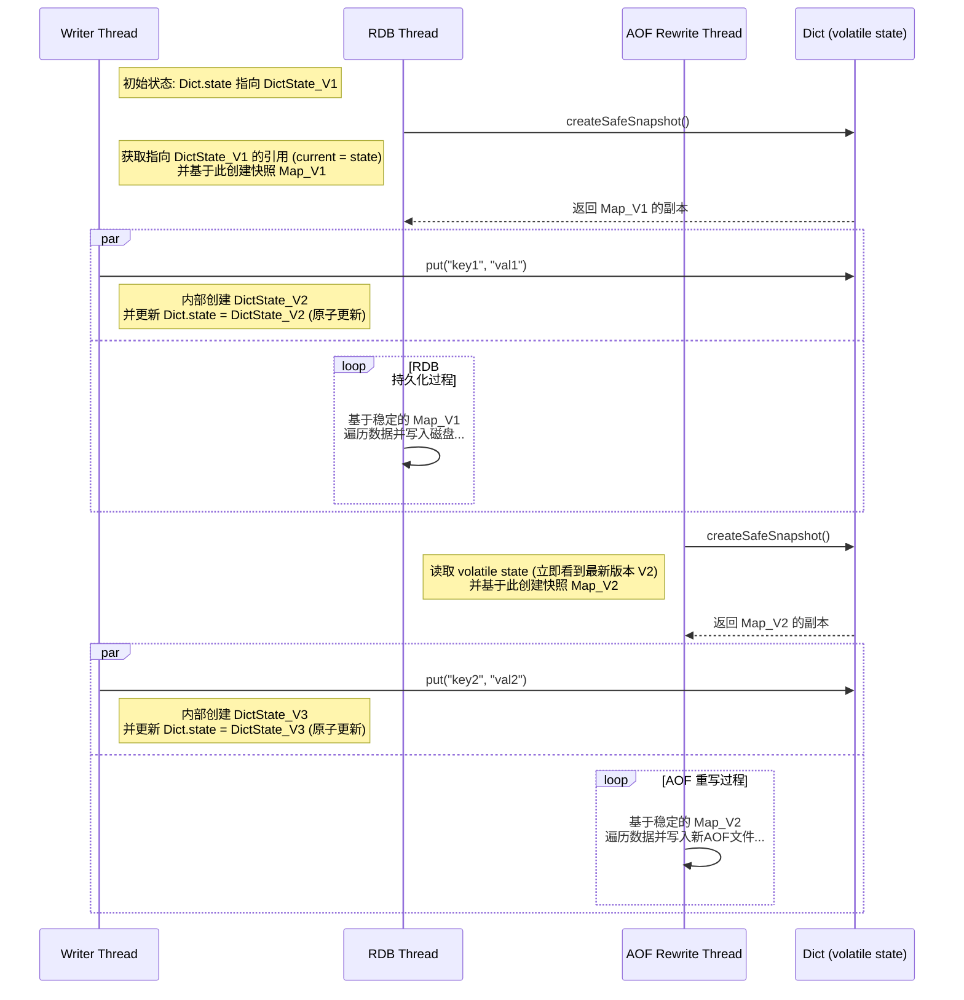
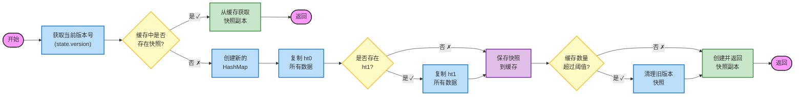

### **当传统哈希表无法满足我：深入剖析Dict如何用CoW和MVCC打造“强一致性快照”数据结构**

>  **核心问题**：如何在Java环境下实现一个支持以下特性的哈希表？
> - 创建完全一致的数据快照（例如：RDB持久化、AOF重写）
> - 支持渐进式扩容（类似Redis的渐进式哈希）
> - 在快照创建期间保持高性能写入

>  **解决方案**：
> - 采用MVCC（多版本并发控制）思想
> - 基于不可变对象实现应用层CoW（写时复制）
> - 单线程写入 + 多线程快照读取的并发模型

-----

### 1\. 初探并发哈希表：为何不走寻常路？

在设计 `redis-mini` 项目的核心数据结构 `Dict` 时，我首先考虑了Java并发利器 `ConcurrentHashMap`。深入分析后发现，它与我的需求存在三个根本性差异：

1. **扩容策略**：`ConcurrentHashMap` 采用被动触发的扩容机制，而 `Dict` 需要主动的渐进式扩容。
2. **并发模型**：`ConcurrentHashMap` 支持多线程写入，而 `Dict` 只需要单线程写入和多线程快照。
3. **一致性要求**：`ConcurrentHashMap` 提供弱一致性视图，而 `Dict` 需要完全一致的时间点快照。

这些差异让我转向了一个全新的设计思路：借鉴MySQL InnoDB的MVCC机制，通过不可变对象和写时复制，实现一个真正适合我们场景的并发哈希表。

#### `ConcurrentHashMap` 的设计哲学与局限

`ConcurrentHashMap` 之所以高效，在于其精妙的并发控制和扩容机制。我们常听闻它"锁粒度是头节点 `synchronized`，并通过 CAS 实现高性能的无锁化"，但这仅仅触及了其并发控制的冰山一角。其**惰性渐进式哈希**，以及在扩容与转发中巧妙结合 **CAS 和 `synchronized`** 来保证原子性是八股文经常不会提及的。

`ConcurrentHashMap` 的扩容过程是一个**协作式**的平滑迁移：

  * **发现扩容 -\> 协助迁移 -\> 继续操作：** 当线程执行 `put` 等操作发现 Map 正在扩容（桶被标记为 `MOVED` 或负载过高）时，它会主动调用 `helpTransfer` 参与数据迁移。
    ```java
    // 发生在 putVal, remove 等方法中
    else if ((fh = f.hash) == MOVED) // 当前桶的哈希值是MOVED，表示它是一个ForwardingNode
        tab = helpTransfer(tab, f); // 调用 helpTransfer 协助扩容
    ```
    `helpTransfer` 通过 **CAS 原子性地增加协助线程计数**，然后调用核心的 `transfer` 方法执行迁移。
    ```java
    // helpTransfer 方法内部
    if (U.compareAndSetInt(this, SIZECTL, sc, sc + 1)) { // CAS 增加协助线程计数
        transfer(tab, nextTab); // 调用核心的 transfer 方法，实际执行数据迁移
        // ...
    }
    ```
  * **数据迁移（`transfer`）中的并发控制：**
      * **CAS 放置转发节点：** 对于空桶，`transfer` 会通过 **CAS** 放置一个 `ForwardingNode`，阻止其他线程在此处写入。
        ```java
        // transfer 方法内部
        else if ((f = tabAt(tab, i)) == null) // 如果当前桶为空
            advance = casTabAt(tab, i, null, fwd); // 尝试通过 CAS 将当前桶设置为ForwardingNode
        ```
      * **`synchronized` 锁迁移非空桶：** 对于非空桶（链表或红黑树），迁移过程会对其**头节点加 `synchronized` 锁**。这是因为迁移一个桶的全部内容是**多步复合操作**，需要 `synchronized` 确保原子性。
        ```java
        // transfer 方法内部
        else { // 处理非空桶
            synchronized (f) { // 对当前桶（头节点 f）加 synchronized 锁
                if (tabAt(tab, i) == f) { // 双重检查，确保在加锁期间没有其他线程修改
                    // ... 内部逻辑：将旧桶中的链表或树结构拆分并迁移到新表 ...
                    setTabAt(tab, i, fwd); // 最后，旧表该索引处设置为ForwardingNode
                    // ...
                }
            }
        }
        ```
  * **读操作的非阻塞转发：** 读线程（如 `get`）在访问旧表桶时，若发现是 `ForwardingNode`，会**非阻塞地**直接在新表 `nextTable` 中查找。这种机制保证了读操作在扩容期间的平滑性。

尽管 `ConcurrentHashMap` 性能卓越，但它不适合我的 `Dict` 项目，主要原因如下：

1.  **扩容策略：** `ConcurrentHashMap` 的扩容是**被动触发**的，只有在负载达到阈值时才进行。而我的 `Dict` 需要一个**主动渐进式哈希**，扩容更频繁，每次迁移的步进也更积极，几乎每次写入操作都可能触发 `rehashStep`。
2.  **复杂性与目标：** `ConcurrentHashMap` 的实现虽然强大，但设计得相对复杂，旨在处理任意数量的并发读写。而我的 `Dict` 的核心需求是**单线程写，多线程快照创建**，这种简化允许我采用不同的并发控制模型。
3.  **一致性视图：** `ConcurrentHashMap` 仅提供**弱一致性视图**。这意味着在扩容期间，`size()` 或迭代器可能无法提供一个精确的、某一时刻的全局快照。对于需要**完全一致快照**的系统，例如 Redis 的 RDB 持久化或 AOF 重写，这都是不可接受的。

正是这些深层次的考量，让我意识到简单模仿 `ConcurrentHashMap` 是一个"大忌"。我需要重新审视自己的核心需求：一个能够创建某一时刻**静止快照**，并支持**多版本状态**的哈希表，他不需要写的高度并发控制，只需要在创建快照的时候实现一个**快照隔离**，让获得的内容是如同**stop the world**一样静态的画面。这不禁让我想到了 **MySQL InnoDB 的 MVCC (多版本并发控制)**。

-----

### 2\. MVCC 启发下的 `Dict` 设计：实现单写多读与版本快照

`Dict` 的并发安全基石是 **不变性 (Immutability)** 和 **写时复制 (Copy-on-Write, CoW)**。我们从最小的构建块开始，逐层解析其设计。

#### 核心数据结构 1：`DictEntry<K, V>` (递归写时复制的不可变节点)

这是哈希表中存储键值对的最基本单元。当需要更新或删除链表中的某个节点时，它并非原地修改，而是通过递归，自底向上地创建一条包含变更的新链表。

`DictEntry` 的核心在于其字段都被 `final` 修饰，保证了对象一旦创建，其内部状态就不可更改。

```java
class DictEntry<K, V> {
    final int hash;
    final K key;
    final V value;
    final DictEntry<K, V> next;

    DictEntry(final int hash, final K key, final V value, final DictEntry<K, V> next) {
        this.hash = hash;
        this.key = key;
        this.value = value;
        this.next = next;
    }

    DictEntry<K, V> updateValue(int targetHash, K targetKey, V newValue) {
        if (this.hash == targetHash && targetKey.equals(this.key)) {
            return new DictEntry<>(this.hash, this.key, newValue, this.next);
        }
        DictEntry<K, V> updatedNext = (this.next != null) ? this.next.updateValue(targetHash, targetKey, newValue) : null;
        return new DictEntry<>(this.hash, this.key, this.value, updatedNext);
    }

    DictEntry<K, V> removeNode(int targetHash, K targetKey) {
        if (this.hash == targetHash && targetKey.equals(this.key)) {
            return this.next;
        }
        DictEntry<K, V> updatedNext = (this.next != null) ? this.next.removeNode(targetHash, targetKey) : null;
        return new DictEntry<>(this.hash, this.key, this.value, updatedNext);
    }
}
```

**关键点：**

  * **`final` 字段**: `hash`, `key`, `value`, `next` 都被 `final` 修饰。这意味着一旦 `DictEntry` 对象被创建，它的所有字段都不能再被修改。这是实现**不可变性**的基石。
  * **`updateValue` 和 `removeNode` 方法**: 这两个方法完美地诠释了**写时复制 (CoW)**。当需要更新或删除链表中的某个节点时，它们不会原地修改 `this.value` 或 `this.next`。相反，它们会从被修改的节点开始，向上游递归地创建新的 `DictEntry` 实例副本。每个新的 `DictEntry` 都会引用它下面的新节点或旧节点，最终返回一个全新的链表头。原始链表保持不变，这确保了正在读取旧链表的其他线程的视图一致性。

<!-- end list -->



**图解简述：**
  * **新链表（蓝色）**: 当更新节点 `C` 时，会递归地创建 `C'`、`B'` 和 `A'` 三个新节点，并重新链接它们的 `next` 指针，最终返回新链表的头节点 `A'`。
  * **原始链表（灰色）**: 在整个操作过程中，原始链表毫发无损。任何正在并发读取它的线程，看到的数据都是一致且完整的，**无需任何加锁**。

> 🔑 **要点总结 - DictEntry**
> - 所有字段都是final，确保节点不可变
> - 更新操作通过递归创建新链表，而不是修改现有节点
> - 实现了零锁开销的并发读取
> - 完美支持写时复制，为快照隔离打下基础

-----

#### 核心数据结构 2：`DictHashTable<K, V>` (哈希桶骨架)

这是承载 `DictEntry` 链表的物理数组，是哈希表的"骨架"。


`DictHashTable` 作为一个**可变**的数据结构，其内部的 `table` 数组是会发生变化的。但是，`Dict` 类通过封装 `DictHashTable` 并结合 `DictState` 的不可变性，来保证整体的并发安全。

```java
class DictHashTable<K, V> {
    final DictEntry<K, V>[] table;
    final int size;
    final int sizemask;
    volatile long used; 

    @SuppressWarnings("unchecked")
    DictHashTable(final int size) {
        if (size <= 0 || (size & (size - 1)) != 0) {
            throw new IllegalArgumentException("Hash table size must be a power of 2, got: " + size);
        }
        this.table = (DictEntry<K, V>[]) new DictEntry[size];
        this.size = size;
        this.sizemask = size - 1;
        this.used = 0;
    }

    int keyIndex(final int hashValue) {
        return hashValue & sizemask;
    }
}
```

**关键点：**

  * **`table` 数组**: 这是一个 `DictEntry` 数组，每个元素是哈希桶的头节点。这个数组本身是可变的，当 `put` 或 `remove` 操作发生时，会更新 `table[idx]` 的引用，使其指向一个新的 `DictEntry` 链表头。
  * **`size` 和 `sizemask`**: 它们被 `final` 修饰，表示哈希表桶的数量和用于快速计算索引的掩码在 `DictHashTable` 实例创建后是不可变的。
  * **`used` 字段**: 这是一个 `volatile long` 类型，用于记录当前哈希表中已使用的条目数量。它确保了写入线程对 `used` 的修改对其他线程（特别是 Rehash 过程中）是可见的。
  * **原子性**: `table[idx] = newHead;` 这样的引用赋值操作是原子性的。读取线程在读取 `DictState` 的快照时，会获取到 `DictHashTable` 的引用，进而访问其 `table` 数组。即使 `table[idx]` 在写入线程中被更新，读取线程要么看到更新前的完整链表，要么看到更新后的完整链表，不会看到一个中间状态。

<!-- end list -->



**图解简述：**
`DictHashTable` 内部持有一个 `DictEntry` 数组（`table`），每个数组槽位（Bucket）指向一个 `DictEntry` 链表的头节点（或为 `null`）。由于模型是**单线程写入**，当需要更新某个桶的链表时（例如，`table[0]` 指向一个新的链表头），这个赋值操作是原子性的，无需担心与其他写线程发生竞争。

> 🔑 **要点总结 - DictHashTable**
> - 数组大小固定，为2的幂次方
> - 桶的更新是原子性的引用替换
> - 通过volatile used字段追踪使用量
> - 为渐进式哈希提供物理存储结构

-----

#### 核心数据结构 3：`DictState<K, V>` (不可变状态快照)

这是 `Dict` 实现 MVCC 的核心。它好比是整个字典在某一瞬间的"全景照片"，自身完全不可变。


`DictState` 是 `Dict` 实现 MVCC 的核心，其所有字段均为 `final`，确保了其不可变性。

```java
static final class DictState<K, V> {
    final DictHashTable<K, V> ht0;
    final DictHashTable<K, V> ht1;
    final int rehashIndex;
    final long version;

    DictState(DictHashTable<K, V> ht0, DictHashTable<K, V> ht1, int rehashIndex, long version) {
        this.ht0 = ht0;
        this.ht1 = ht1;
        this.rehashIndex = rehashIndex;
        this.version = version;
    }

    DictState<K, V> withRehashIndex(int newRehashIndex, long newVersion) {
        return new DictState<>(this.ht0, this.ht1, newRehashIndex, newVersion);
    }

    DictState<K, V> withHt0AndHt1AndRehashIndex(DictHashTable<K, V> newHt0, DictHashTable<K, V> newHt1,
                                                 int newRehashIndex, long newVersion) {
        return new DictState<>(newHt0, newHt1, newRehashIndex, newVersion);
    }
}
```

**关键点：**

  * **`final` 字段**: `ht0`, `ht1`, `rehashIndex`, `version` 都是 `final` 的。这意味着一旦一个 `DictState` 实例被创建，它引用的哈希表（`DictHashTable` 实例）、Rehash 索引和版本号就不能再改变。
  * **`Dict` 类中的 `state` 字段**:
    ```java
    private volatile DictState<K, V> state;
    ```
    这个 `state` 字段是 `Dict` 类中唯一一个可变的引用，并且被 `volatile` 修饰。这保证了**内存可见性**和**有序性**：任何对 `state` 的写入都会立即对所有其他线程可见，并且保证了操作的原子性。
  * **版本号 (`version`)**: `DictState` 中包含一个 `version` 字段，每次 `Dict` 发生结构性变化（`put`, `remove`, `rehashStep` 导致 `DictState` 替换）时，`version` 都会递增。这个版本号是快照机制的关键。
  * **CoW at `DictState` level**: 当 `Dict` 需要改变其内部结构（如添加/删除元素、Rehash）时，它不会修改当前的 `state` 对象。相反，它会创建一个**新的 `DictState` 实例**，其中包含了更新后的哈希表引用和递增后的版本号，然后原子性地将 `Dict` 的 `volatile state` 引用指向这个新的 `DictState` 实例。这种设计使得读取线程只需获取 `state` 的一个引用，就能获得一个在那个时间点上完全一致的字典视图。

<!-- end list -->



**图解简述：**
`DictState` 封装了字典在特定版本下的**完整状态**：主哈希表 `ht0`、用于 Rehash 的 `ht1`（仅在 Rehash 时存在）、Rehash 进度 `rehashIndex` 以及一个版本号 `version`。任何会导致字典结构变化的写操作（`put`、`remove`、`rehashStep`），都不会修改当前的 `DictState`。取而代之的是，它会创建一个**全新的 `DictState` 对象**。

> 🔑 **要点总结 - DictState**
> - 完全不可变的状态容器
> - 通过version实现多版本控制
> - 支持原子性的状态切换
> - 为快照创建提供数据视图隔离

-----

### 顶层 `Dict` 并发模型：单写多"快照"，版本一致

现在，我们将所有部分组合起来，展示真正亮点：**一个写入线程**如何与**多个需要全量数据快照的后台线程**（例如，一个用于 RDB 持久化，另一个用于 AOF 重写）并行工作而互不干扰。



**图解简述：**

1.  **RDB 线程启动**: `RDB Thread` 调用 `createSafeSnapshot()`。此方法首先读取 `Dict` 的 `volatile state` 字段，获取当前 `DictState` 的引用（假设是 **Version 1**）。由于 `DictState` 是不可变的，RDB 线程将基于这个固定的 `DictState_V1` 对象遍历其内部的 `ht0` 和 `ht1` 来生成一个完整的 `HashMap` 快照 `Map_V1`，并获得其副本。此后，RDB 线程开始它漫长的数据遍历和磁盘写入过程，它操作的数据视图被永远"冻结"在了 Version 1。

2.  **写入线程持续工作**: 在 RDB 持久化的同时，`Writer Thread` 接收到新的 `put` 请求。它会根据操作创建新的 `DictEntry` 链表，更新 `DictHashTable` 中的桶引用。由于 `DictState` 是不可变的，它会创建一个新的 `DictState` 对象（**Version 2**），其中包含了更新后的 `DictHashTable` 引用以及递增的版本号。最后，它原子性地将 `Dict.state` 的引用更新为这个 `DictState_V2`。**这个过程完全不会影响正在操作 `DictState_V1` 数据的 RDB 线程**。

3.  **AOF 重写线程启动**: 此刻，`AOF Rewrite Thread` 也调用 `createSafeSnapshot()`。由于 `Dict.state` 是 `volatile` 的，它会立即读取到最新的引用，从而获取 **Version 2** 的状态快照 (`DictState_V2`)。AOF 线程也开始基于这个更新、但同样稳定的数据视图 `Map_V2` 进行工作。

4.  **完全并行**: RDB 线程在自己的 Version 1 世界里工作，AOF 线程在自己的 Version 2 世界里工作，而写入线程可以继续创建 Version 3、Version 4……三者（甚至更多）**完美并行，互不阻塞，互不干扰**。

-----

#### `createSafeSnapshot()` 的实现：带缓存的高效快照

`Dict` 最具价值的功能之一就是创建强一致性的快照。

`createSafeSnapshot()` 方法是 `Dict` 核心并发模型的具体体现。

```java
public class Dict<K,V> {
    // ... 其他字段和常量 ...

    private volatile DictState<K, V> state;
    private AtomicLong versionGenerator = new AtomicLong(0);
    private final ConcurrentHashMap<Long, VersionedSnapshot<K, V>> snapshotCache = new ConcurrentHashMap<>();
    private static final int CACHE_CLEANUP_THRESHOLD = 100;

    public Map<K, V> createSafeSnapshot() {
        final long currentVersion = state.version;

        VersionedSnapshot<K, V> cachedSnapshot = snapshotCache.get(currentVersion);
        if (cachedSnapshot != null) {
            return new HashMap<>(cachedSnapshot.data); 
        }

        final Map<K, V> snapshot = new HashMap<>();
        final DictState<K, V> current = state; // 获取当前 state 的本地副本，确保一致性

        createSnapshotFromTable(current.ht0, snapshot);
        if (current.rehashIndex != -1 && current.ht1 != null) {
            createSnapshotFromTable(current.ht1, snapshot);
        }

        VersionedSnapshot<K, V> newSnapshot = new VersionedSnapshot<>(currentVersion, snapshot);
        snapshotCache.put(currentVersion, newSnapshot);

        if (snapshotCache.size() > CACHE_CLEANUP_THRESHOLD) {
            cleanupOldSnapshots();
        }

        return new HashMap<>(snapshot); // 返回快照副本
    }

    private void createSnapshotFromTable(final DictHashTable<K, V> table, final Map<K, V> snapshot) {
        if (table == null) return;

        for (int i = 0; i < table.size; i++) {
            DictEntry<K, V> current = table.table[i];
            while (current != null) {
                snapshot.put(current.key, current.value); 
                current = current.next;
            }
        }
    }
}
```

**关键点：**

  * **`final DictState<K, V> current = state;`**: 这一行是实现快照一致性的核心。它将 `volatile state` 的当前引用读取到一个局部 `final` 变量 `current` 中。这意味着 `createSafeSnapshot()` 方法在执行期间，无论 `Writer Thread` 如何更新 `Dict.state`，它都将始终基于这个 `current` 所引用的特定版本的 `DictState` 来构建快照。
  * **`snapshotCache`**: 使用 `ConcurrentHashMap` 作为缓存，因为它支持并发读写，可以高效地存储和检索 `VersionedSnapshot`。
  * **版本号作为缓存 Key**: `state.version` 被用作缓存的键。如果某个版本的快照已经被生成并缓存，那么后续对同一版本快照的请求可以直接从缓存中获取，避免了重复的全量复制开销。
  * **返回副本**: 无论是从缓存中获取还是新生成的快照，`createSafeSnapshot()` 始终返回一个 `HashMap` 的新实例 (`new HashMap<>(snapshot)`)。这确保了调用者无法通过修改返回的 `Map` 来影响缓存中的原始快照数据，维护了快照的不可变性和完整性。
  * **`cleanupOldSnapshots()`**: 定期清理旧版本的快照缓存，防止内存无限增长。

-----

### `createSafeSnapshot()` 的实现：带缓存的高效快照

`Dict` 最具价值的功能之一就是创建强一致性的快照。



**图解简述：**
1. **获取版本**：首先锁定当前 `state` 的**版本号**。
2. **缓存优先**：检查此版本的快照是否已存在于 `snapshotCache` (`ConcurrentHashMap`) 中。如果命中，直接返回一个**副本**（防止外部修改污染缓存），成本极低。
3. **创建新快照**：如果缓存未命中，则遍历当前 `state` 下的 `ht0` 和 `ht1`（如果存在），将所有数据复制到一个新的 `HashMap` 中。
4. **缓存与返回**：将新快照（包含版本号和数据）存入 `snapshotCache` 以备后用，并返回其**副本**。同时，会定期清理过期快照，避免内存无限增长。

-----

### 3\. 与 Redis 官方实现的异同：Java 环境下的 CoW 实践

Redis 在执行 RDB 或 AOF 重写时，利用了操作系统 `fork()` 的能力，在子进程中实现写时复制 (CoW)。这在 Java 中是不可行的，因为 JVM 无法直接进行操作系统的 `fork` 并共享内存页。

我的 `Dict` 通过**应用层面的 CoW** 达到了异曲同工之妙：

  * **不变的数据结构** (`DictEntry`, `DictState`) 模拟了 `fork` 后独立的内存视图。`DictState` 在每次结构性修改时都会创建新实例，`DictEntry` 在链表修改时也会递归创建新实例，这就像 `fork` 后的进程拥有了父进程内存空间的一个逻辑副本。
  * **`volatile` 的 `state` 引用** 扮演了原子性切换数据视图的角色。这类似于 Redis 父进程在 `fork` 后更新指向新 AOF/RDB 文件的指针。
  * **单线程写入模型** 绕开了 Java 中实现复杂锁机制的成本，与 Redis 的单线程处理命令有着相似的哲学。这种设计极大地简化了并发逻辑，因为所有的写操作都是序列化的，无需担心写-写竞争。

这种设计在 Java 环境下，通过巧妙地利用对象不可变性和 `volatile` 关键字，成功模拟了操作系统级别的 CoW 行为，实现了高性能的单写多读并发模型以及强一致性快照，非常适合 `redis-mini` 这种需要持久化和后台操作的场景。

---

### 总结：应用层CoW的优雅实现

>  **核心成果**
> - 实现了一个支持完全一致性快照的并发哈希表
> - 在Java环境下优雅模拟了Redis的fork-CoW机制
> - 完美平衡了写入性能与快照创建的需求

>  **创新亮点**
> 1. **多层次的不可变性设计**
>    - `DictEntry`: 不可变的链表节点
>    - `DictState`: 不可变的状态容器
>    - 通过不可变性实现无锁的并发读取
> 
> 2. **优雅的MVCC实现**
>    - 版本化的状态管理
>    - 写时复制而非原地修改
>    - 快照缓存优化性能
> 
> 3. **高效的并发模型**
>    - 单线程写入避免复杂锁
>    - 多线程快照完全隔离
>    - 渐进式哈希减少阻塞

>  **应用价值**
> - 为Redis-like系统提供了Java环境下的可靠实现
> - 展示了如何在应用层面实现系统级特性
> - 为类似场景的并发设计提供了新思路