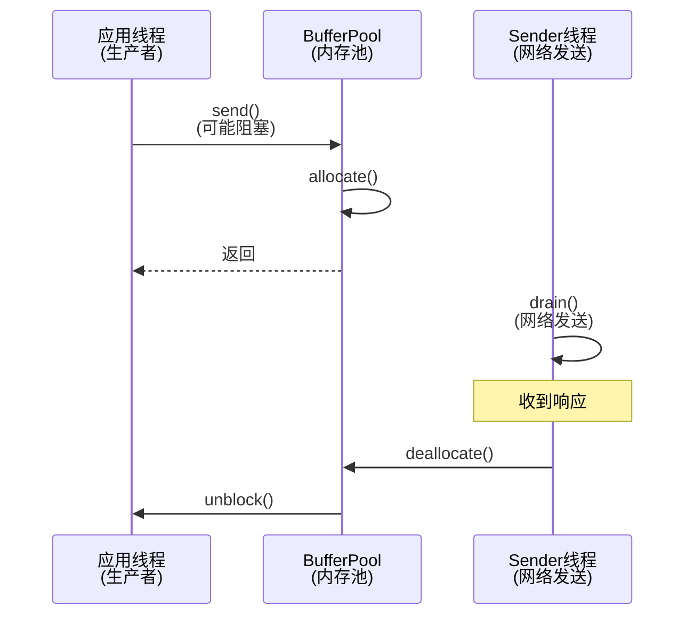
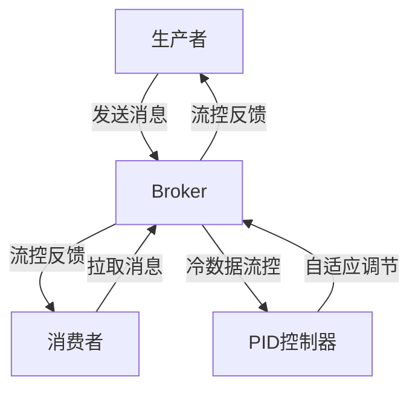

# 消息中间件背压机制深度解析

## 一、背压机制基础概念

### 1.1 什么是背压(Back Pressure)?

背压是一种流量控制机制,用于处理系统中生产者和消费者处理能力不匹配的情况。简单来说,就是当下游系统(消费者)处理数据的速度跟不上上游系统(生产者)产生数据的速度时,需要一种机制来对上游进行限流,从而保护系统不会因为负载过高而崩溃。

### 1.2 为什么需要背压机制?

1. **系统稳定性保护**
   - 防止消费者被大量数据压垮
   - 避免内存溢出(OOM)问题
   - 保持系统的可用性和稳定性

2. **资源合理利用**
   - 在系统负载高峰期合理分配资源
   - 避免资源浪费和过度消耗
   - 实现系统的最优性能

3. **流量调节与控制**
   - 自适应调节处理速率
   - 平滑处理突发流量
   - 确保服务质量(QoS)

## 二、Kafka生产者背压机制深度解析

### 2.1 概述

Kafka生产者通过**BufferPool内存池**实现了一套巧妙的天然背压机制。这套机制的核心思想是：**将本地内存分配与远程网络传输的生命周期绑定**，通过内存占用状态来感知网络压力，从而自动调节生产速度。

### 2.2 核心组件架构



### 2.3 BufferPool机制深入理解

#### 2.3.1 生活化比喻：停车场模型

在深入源码之前，让我们用一个简单的比喻来理解BufferPool的工作原理：

**BufferPool就像一个有固定车位的停车场：**
- **停车场** = BufferPool内存池，有固定的总容量
- **应用线程** = 想要停车的司机，需要发送消息就像需要停车位
- **Sender线程** = 停车场出口的收费员，负责让车辆离开（发送消息到网络）
- **车位满了** = 内存池耗尽，新来的司机（应用线程）必须在入口排队等待
- **waiters队列** = 停车场入口的排队区，先到先得（FIFO）
- **收费员放走一辆车** = 网络发送成功，释放一块内存，通知下一个等待的司机可以进场

这个模型的巧妙之处在于：**停车位的使用情况直接反映了收费员的工作效率**。如果网络很慢（收费员效率低），停车位很快就满了，司机们自然就被迫等待，从而自动降低了进场速度。

现在带着这个模型，我们来看具体的源码实现：

#### 2.3.2 内存分配入口：RecordAccumulator.append()

```java
// f:\kafka\clients\src\main\java\org\apache\kafka\clients\producer\internals\RecordAccumulator.java
public RecordAppendResult append(String topic, int partition, long timestamp, byte[] key, byte[] value, 
                                Header[] headers, AppendCallbacks callbacks, long maxTimeToBlock, 
                                long nowMs, Cluster cluster) throws InterruptedException {
    
    // 1. 尝试添加到现有批次
    RecordAppendResult appendResult = tryAppend(timestamp, key, value, headers, callbacks, dq, nowMs);
    if (appendResult != null) {
        return appendResult; // 成功添加，无需分配新内存
    }

    // 2. 现有批次装不下，需要创建新批次
    if (buffer == null) {
        int size = Math.max(this.batchSize, AbstractRecords.estimateSizeInBytesUpperBound(
                RecordBatch.CURRENT_MAGIC_VALUE, compression.type(), key, value, headers));
        log.trace("Allocating a new {} byte message buffer for topic {} partition {} with remaining timeout {}ms", 
                  size, topic, effectivePartition, maxTimeToBlock);
        
        // 🔥 关键：这里会阻塞！
        buffer = free.allocate(size, maxTimeToBlock);
    }
    
    // 3. 创建新批次并使用分配的内存
    RecordAppendResult appendResult = appendNewBatch(topic, effectivePartition, dq, timestamp, key, value, 
                                                    headers, callbacks, buffer, nowMs);
    if (appendResult.newBatchCreated)
        buffer = null; // 内存已被批次持有，防止重复释放
        
    return appendResult;
}
```

#### 2.3.3 内存池核心：BufferPool.allocate()

现在让我们看看"停车场管理员"是如何工作的：

```java
// f:\kafka\clients\src\main\java\org\apache\kafka\clients\producer\internals\BufferPool.java
public ByteBuffer allocate(int size, long maxTimeToBlockMs) throws InterruptedException {
    // 1. 基础检查 - 司机要求的车位大小不能超过停车场总容量
    if (size > this.totalMemory)
        throw new IllegalArgumentException("Attempt to allocate " + size + " bytes, but there is a hard limit of " 
                                         + this.totalMemory + " on memory allocations.");

    ByteBuffer buffer = null;
    this.lock.lock(); // 停车场管理需要同步，防止冲突
    try {        // 2. 快速路径：从池化缓存获取 - 有现成的标准车位可用
        if (size == poolableSize && !this.free.isEmpty())
            return this.free.pollFirst();

        // 3. 检查是否有足够内存立即满足请求 - 计算可用车位
        int freeListSize = freeSize() * this.poolableSize;
        if (this.nonPooledAvailableMemory + freeListSize >= size) {
            // 有足够内存，立即分配 - 有空位，直接进场
            freeUp(size);
            this.nonPooledAvailableMemory -= size;
        } else {
            // 🚗 停车场满了！司机必须排队等待
            int accumulated = 0;
            Condition moreMemory = this.lock.newCondition(); // 个人的等待信号
            long remainingTimeToBlockNs = TimeUnit.MILLISECONDS.toNanos(maxTimeToBlockMs);
            
            // FIFO队列：先来的司机先进场，体现公平性
            this.waiters.addLast(moreMemory);
            
            // 循环等待直到获得足够内存 - 在停车场入口耐心等待
            while (accumulated < size) {
                long startWaitNs = time.nanoseconds();
                boolean waitingTimeElapsed = !moreMemory.await(remainingTimeToBlockNs, TimeUnit.NANOSECONDS);
                
                // 记录等待时间用于监控 - 统计平均等车时间
                long endWaitNs = time.nanoseconds();
                long timeNs = Math.max(0L, endWaitNs - startWaitNs);
                recordWaitTime(timeNs);                if (waitingTimeElapsed) {
                    // 等车超时，司机放弃离开 - 抛出内存耗尽异常
                    throw new BufferExhaustedException("Failed to allocate " + size + " bytes within " + 
                        "the configured max blocking time " + maxTimeToBlockMs + " ms. " +
                        "Total memory: " + totalMemory() + " bytes. " +
                        "Available memory: " + availableMemory() + " bytes.");
                }

                // 尝试分配内存
                if (accumulated == 0 && size == this.poolableSize && !this.free.isEmpty()) {
                    buffer = this.free.pollFirst();
                    accumulated = size;
                } else {
                    freeUp(size - accumulated);
                    int got = (int) Math.min(size - accumulated, this.nonPooledAvailableMemory);
                    this.nonPooledAvailableMemory -= got;
                    accumulated += got;
                }
            }        }
    } finally {
        // 有车位空出来了，通知下一个等待的司机
        if (!(this.nonPooledAvailableMemory == 0 && this.free.isEmpty()) && !this.waiters.isEmpty())
            this.waiters.peekFirst().signal();
        lock.unlock();
    }

    // 分配实际的ByteBuffer
    return buffer == null ? safeAllocateByteBuffer(size) : buffer;
}
```

#### 2.3.4 内存释放：Sender线程的响应处理

现在我们来看"收费员"是如何放车出场的：

```java
// f:\kafka\clients\src\main\java\org\apache\kafka\clients\producer\internals\Sender.java
private void completeBatch(ProducerBatch batch, ProduceResponse.PartitionResponse response) {
    if (transactionManager != null) {
        transactionManager.handleCompletedBatch(batch, response);
    }

    // 网络发送成功！可以让这辆车出停车场了
    if (batch.complete(response.baseOffset, response.logAppendTime)) {
        maybeRemoveAndDeallocateBatch(batch);
    }
}

private void maybeRemoveAndDeallocateBatch(ProducerBatch batch) {
    maybeRemoveFromInflightBatches(batch);
    //  车辆出场，释放车位给停车场
    this.accumulator.deallocate(batch);
}
```

```java
// f:\kafka\clients\src\main\java\org\apache\kafka\clients\producer\internals\RecordAccumulator.java
public void deallocate(ProducerBatch batch) {
    incomplete.remove(batch);
    if (!batch.isSplitBatch())
        free.deallocate(batch.buffer(), batch.initialCapacity()); // 调用BufferPool释放
}
```

```java
// f:\kafka\clients\src\main\java\org\apache\kafka\clients\producer\internals\BufferPool.java
public void deallocate(ByteBuffer buffer, int size) {
    lock.lock();
    try {
        if (size == this.poolableSize && size == buffer.capacity()) {
            // 标准大小的buffer，回收到池中
            buffer.clear();
            this.free.add(buffer);
        } else {
            // 非标准大小，直接释放内存计数
            this.nonPooledAvailableMemory += size;
        }
        
        // 🔥 关键：唤醒等待的线程
        Condition moreMem = this.waiters.peekFirst();
        if (moreMem != null)
            moreMem.signal();
    } finally {
        lock.unlock();
    }
}
```

### 2.4 背压机制的工作原理

#### 2.4.1 内存占用生命周期

```
1. 创建批次时分配内存
   ↓
2. 批次发送到网络
   ↓
3. 内存被持有(等待网络响应)
   ↓
4. 收到Broker响应
   ↓
5. 释放内存回BufferPool
   ↓
6. 唤醒等待的生产者线程
```

#### 2.4.2 背压触发条件

```java
// 可用内存计算
public long availableMemory() {
    return this.nonPooledAvailableMemory + freeSize() * (long) this.poolableSize;
}

// 阻塞条件
if (可用内存 < 新请求的内存大小) {
    // 进入FIFO等待队列，直到有内存释放
    waitForMemoryRelease();
}
```

## 三、Kafka Broker端背压机制：分布式限流器

### 3.1 用限流器理解Broker背压

Broker端背压本质上就是一个**智能限流器**，就像现实中常见的限流场景：

### 🚦 限流器类比

| 现实场景 | Kafka Broker背压 |
|---------|-----------------|
| **景区限流** | 每个客户端有访问配额 |
| **测速检查** | 实时监控请求速率 |
| **临时封路** | 超速连接暂时静音 |
| **定时开放** | 延迟队列到期恢复 |

### 3.2 Broker限流器的工作原理

#### 3.2.1 令牌桶算法 - 速率检测

```scala
// ClientQuotaManager.scala - 核心限流逻辑
def maybeRecordAndGetThrottleTimeMs(clientId: String, requestSize: Double): Int = {
  // 1. 记录本次请求消耗的资源
  clientMetrics.record(requestSize)
  
  // 2. 检查是否超过配额限制（类似令牌桶检查）
  val throttleTimeMs = clientMetrics.throttleTime()
  
  // 3. 返回需要限流的时间
  if (throttleTimeMs > 0) throttleTimeMs.toInt else 0
}
```

**限流逻辑**：
- 每个客户端都有自己的"令牌桶"（配额）
- 每次请求消耗一定的"令牌"（字节数/请求数）
- 令牌用完了就需要等待恢复（throttle时间）

#### 3.2.2 连接熔断 - 临时隔离

```scala
// SocketServer.scala - 限流执行
def processNewResponses(): Unit = {
  currentResponse match {
    case _: StartThrottlingResponse =>
      // 🔥 触发熔断：暂停处理该客户端请求
      muteChannel(channelId)  // 类似熔断器的OPEN状态
      
    case _: EndThrottlingResponse =>  
      // 🔥 恢复服务：重新处理该客户端请求
      unmuteChannel(channelId)  // 类似熔断器的CLOSED状态
  }
}
```

**熔断机制**：
- **CLOSED状态**：正常处理请求
- **OPEN状态**：超速时暂停处理，连接"静音"
- **自动恢复**：延迟时间到后自动回到CLOSED状态

#### 3.2.3 延迟队列 - 限流恢复

```java
// ThrottledChannel.java - 延迟恢复机制
public class ThrottledChannel implements Delayed {
    private final long endTimeNanos;  // 限流结束时间
    
    // 检查是否到了恢复时间
    public long getDelay(TimeUnit unit) {
        return unit.convert(endTimeNanos - currentTime, TimeUnit.NANOSECONDS);
    }
}
```

**定时恢复**：
- 被限流的连接放入延迟队列
- 后台线程定期检查队列
- 时间到了自动解除限流

### 3.3 限流模式

#### 3.3.1 Kafka Broker = 滑动窗口限流器

```
┌─────────────────────────────────────┐
│  滑动时间窗口（比如10秒）            │
│  ┌──┬──┬──┬──┬──┬──┬──┬──┬──┬──┐   │
│  │  │  │  │  │  │  │  │██│██│██│   │ 
│  └──┴──┴──┴──┴──┴──┴──┴──┴──┴──┘   │
│                      ↑              │
│               最近3秒请求过多，限流！   │
└─────────────────────────────────────┘
```

#### 3.3.2 限流效果

| 客户端速率 | 配额限制 | 限流时间 | 效果 |
|-----------|---------|---------|------|
| 800 req/s | 1000 req/s | 0ms | ✅ 正常通行 |
| 1200 req/s | 1000 req/s | 2000ms | ⏸️ 限流2秒 |
| 2000 req/s | 1000 req/s | 10000ms | 🚫 限流10秒 |

### 3.4 背压传导链

这个分布式限流器的妙处在于**无感知降速**：

```
📱 客户端疯狂发送
        ↓
🔍 Broker检测超速 (限流器触发)
        ↓  
🔇 连接静音 (熔断器打开)
        ↓
📦 TCP缓冲区堆积 (自然反压)
        ↓
😔 客户端感受到变慢 (被迫降速)
        ↓
⏰ 时间到恢复连接 (熔断器关闭)
```

**关键优势**：
- **无需修改客户端**：客户端无感知，自动适应
- **精确控制**：可以精确到字节级的速率控制  
- **公平隔离**：恶意客户端不影响其他客户端
- **自动恢复**：不需要人工干预，系统自愈

### 3.5 Kafka背压机制的设计精髓

这就是为什么Kafka能处理大规模流量的秘密武器 — 一个设计精妙的**分布式自适应限流器**！

Kafka的设计之所以如此迷人，在于**1+1>2的协同效应**。单独来看，这两个限流器都算不上特别厉害，但组合起来却产生了化学反应：

#### 3.5.1 单一限流器的局限性

**如果只有Producer端BufferPool限流器**：
- ✅ **优势**：能够保护单个Producer实例不被压垮
- ❌ **局限**：只了解自己的情况，无法感知其他Producer的行为
- ⚠️ **风险**：其他Producer流量过大时，可能导致整个Broker集群被拖垮

**如果只有Broker端配额限流器**：
- ✅ **优势**：能够全局控制流量，保护Broker集群
- ❌ **局限**：只能通过"静音连接+TCP缓冲区堆积"间接迫使客户端降速
- ⚠️ **风险**：客户端无法明确感知限流信号，可能持续重试加剧压力

#### 3.5.2 协同设计的威力

正是因为BufferPool的存在，Broker端限流器才能发挥真正的功效：

```
🏭 Producer压力 ←→ 📦 BufferPool感知 ←→ 🎯 精确背压
     ↑                    ↓                    ↓
🌐 Broker限流 ←→ 📡 TCP压力传导 ←→ ⚡ 自动降速
```

**协同优势**：
1. **双向感知**：Producer感知网络压力，Broker感知全局压力
2. **精确传导**：通过内存池状态精确反映网络状况
3. **自然平衡**：无需复杂协议，系统自发达到平衡状态
4. **故障隔离**：单点故障不会影响整体限流效果

这就是Kafka背压机制的精髓 — **相辅相成的分布式协同限流**。两个看似简单的组件，通过巧妙的设计形成了一个自适应、高效、稳定的流控系统。

## 四、RocketMQ背压机制深度解析

### 4.1 概述

RocketMQ实现了多层次的背压机制，包括生产者端、消费者端和Broker端。其中最具特色的是基于**PID（比例-积分-微分）控制算法**的自适应流控机制，这让RocketMQ能够更智能地应对系统压力。

#### 4.1.1 什么是冷热数据？

在深入PID控制之前，我们需要理解RocketMQ中一个重要概念：**冷热数据**。

**热数据（Hot Data）**：
- 最近写入的消息，通常还在内存中（PageCache）
- 读取速度极快，几乎不涉及磁盘IO
- 典型场景：刚发送的消息被消费者立即消费

**冷数据（Cold Data）**：
- 较久之前的消息，已经被刷写到磁盘
- 读取需要从磁盘加载，速度相对较慢
- 典型场景：消费者重置消费位点，读取历史消息

**为什么要区别对待冷热数据？**
- **性能保护**：大量冷数据读取会产生密集的磁盘IO，可能影响热数据的服务质量
- **资源隔离**：避免历史数据查询影响实时消息处理
- **系统稳定**：防止磁盘IO打满导致整个Broker响应变慢

这就是为什么RocketMQ需要智能的流控机制来平衡冷热数据的访问。

### 4.2 PID控制算法详解

#### 4.2.1 生活化比喻：浴室水温调节

在深入RocketMQ的PID实现之前，让我们用调节浴室水温的例子来理解PID控制的精髓：

假设你在调节淋浴的水温，目标是42°C，当前水温是35°C：

**P（比例控制）- 看当下**：
- 你感觉水太冷了，temperature_error = 42 - 35 = 7°C
- 误差越大，你调节的幅度就越大，所以你猛地向热水方向拧了一大把
- 特点：反应快速，但容易"用力过猛"导致水温过热

**I（积分控制）- 修正历史**：
- 你调了好一会儿，发现水温总是稳定在41°C，就是比目标低1°C
- 这可能是因为管道散热等因素造成的"系统性偏差"
- 于是你吸取"历史教训"，在P控制的基础上再多往热水方向拧一点
- 特点：消除长期存在的稳态误差，但响应较慢

**D（微分控制）- 预测未来**：
- 你看到水温正在快速上升，从35°C已经升到40°C了，变化很快
- 虽然还没到42°C，但按这个趋势很快就会超过，甚至可能过热
- 于是你提前回调龙头，防止水温冲过头
- 特点：根据变化趋势进行预判，防止系统震荡

**PID综合控制**：
```
调节量 = KP × 当前误差 + KI × 历史误差累积 + KD × 误差变化趋势
```

这样你就能快速、准确、稳定地调节到理想水温，既不会太慢，也不会震荡。

#### 4.2.2 RocketMQ中的PID应用

在RocketMQ中，这个"水温"就是系统的消费压力：
- **目标值**：期望的消费吞吐量
- **当前值**：实际的消费吞吐量  
- **控制输出**：流控阈值的调整幅度

### 4.3 核心组件架构



### 4.4 多层次背压机制

#### 4.4.1 消费者端背压

消费者采用了多维度的阈值控制：

```java
// 消息数量阈值控制 - 防止内存中堆积过多消息
if (cachedMessageCount > defaultMQPushConsumer.getPullThresholdForQueue()) {
    this.executePullRequestLater(pullRequest, PULL_TIME_DELAY_MILLS_WHEN_CACHE_FLOW_CONTROL);
}

// 消息大小阈值控制 - 防止内存占用过大
if (cachedMessageSizeInMiB > defaultMQPushConsumer.getPullThresholdSizeForQueue()) {
    this.executePullRequestLater(pullRequest, PULL_TIME_DELAY_MILLS_WHEN_CACHE_FLOW_CONTROL);
}
```

当消费者本地缓存的消息数量或大小超过阈值时，会触发背压，暂停拉取新消息。这类似于我们前面提到的"停车场"模型。

#### 4.4.2 生产者端背压

生产者端主要通过异步发送队列的长度来实现背压：

```java
// 异步发送流控 - 防止发送队列过长
while (e.getQueue().size() > MAX_LENGTH_ASYNC_QUEUE) {
    Thread.sleep(SLEEP_FOR_A_WHILE);
}
```

#### 4.4.3 Broker端智能背压：PID算法实现

这是RocketMQ最精彩的部分，让我们看看"浴室水温调节器"在代码中的实现：

```java
public class PIDAdaptiveColdCtrStrategy implements ColdCtrStrategy {
    // PID控制参数 - 就像调节龙头的三种方式
    private static final Double KP = 0.5;  // 比例系数：看当前误差有多大
    private static final Double KI = 0.3;  // 积分系数：修正历史累积偏差  
    private static final Double KD = 0.2;  // 微分系数：预测未来变化趋势
    
    @Override
    public Double decisionFactor() {
        Long et1 = historyEtValList.get(historyEtValList.size() - 1); // 当前误差（水温差多少）
        Long et2 = historyEtValList.get(historyEtValList.size() - 2); // 上一次误差
        Long differential = et1 - et2;  // 误差变化率（温度变化有多快）
        Double integration = 0.0;  // 误差积分（历史偏差累计）
        for (Long item: historyEtValList) {
            integration += item;
        }
        // 🌡️ 就像调节水温：当前偏差 + 历史经验 + 变化趋势
        return KP * et + KI * integration + KD * differential;
    }
}
```

**在RocketMQ的应用场景中**：
- **P控制**：当前消费速率与期望值的偏差（水温与目标温度的差距）
- **I控制**：历史累积偏差，消除系统性的处理能力不足（管道散热补偿）
- **D控制**：消费速率的变化趋势，防止调节过度导致震荡（提前预判温度变化）

#### 4.4.4 冷热数据智能流控

基于前面我们对冷热数据的理解，现在来看RocketMQ如何运用PID控制进行精妙的自适应调节：

##### 4.4.4.1 动态加速减速：智能"油门"

```java
@Override
public void promote(String consumerGroup, Long currentThreshold) {
    if (decisionFactor() > 0) {
        // 🚗 系统状态良好，踩油门提速！
        // 当PID决策因子为正时，说明当前处理能力富余，可以提高阈值加速消费
        coldDataCgCtrService.addOrUpdateGroupConfig(consumerGroup, 
            (long)(currentThreshold * 1.5));  // 提速50%，就像水温还不够热，继续拧热水
    }
}

@Override
public void decelerate(String consumerGroup, Long currentThreshold) {
    if (decisionFactor() < 0) {
        // 🛑 系统压力大，踩刹车减速！
        // 当PID决策因子为负时，说明系统压力大，需要降低阈值减缓消费
        long changedThresholdVal = (long)(currentThreshold * 0.8);  // 降速20%，就像水温过热，回调龙头
        // 设置下限，保证不会降到太低影响基本服务
        if (changedThresholdVal < coldDataCgCtrService.getBrokerConfig().getCgColdReadThreshold()) {
            changedThresholdVal = coldDataCgCtrService.getBrokerConfig().getCgColdReadThreshold();
        }
        coldDataCgCtrService.addOrUpdateGroupConfig(consumerGroup, changedThresholdVal);
    }
}
```

这里的巧妙之处在于：**系统会根据PID算法的输出自动调节"油门大小"**，既不会过于保守浪费资源，也不会过于激进导致系统崩溃。

##### 4.4.4.2 场景自适应控制：区分冷热数据访问模式

```java
if (cgNeedColdDataFlowCtr) {
    // 🧊 检查消息是否属于冷数据（存储在磁盘中）
    boolean isMsgLogicCold = defaultMessageStore.getCommitLog()
        .getColdDataCheckService().isMsgInColdArea(...);
    if (isMsgLogicCold) {
        // 🔥 根据消费类型采用不同的流控策略
        if (consumeType == ConsumeType.CONSUME_PASSIVELY) {
            // 被动消费（推模式）：直接流控，快速响应
            response.setCode(ResponseCode.SYSTEM_BUSY);  
        } else if (consumeType == ConsumeType.CONSUME_ACTIVELY) {
            // 主动消费（拉模式）：降低批量大小，减少单次IO压力
            requestHeader.setMaxMsgNums(1);  
        }
    }
}
```

**设计思路解析**：
- **推模式（PASSIVE）**：消费者被动接收，对延迟敏感，所以冷数据直接拒绝，避免影响热数据推送
- **拉模式（ACTIVE）**：消费者主动拉取，通常用于离线分析等场景，允许读取冷数据但限制批量大小

##### 4.4.4.3 历史压力感知：PID的"记忆"

```java
@Override
public void collect(Long globalAcc) {
    et = expectGlobalVal - globalAcc;  // 计算当前误差：期望值 - 实际值
    historyEtValList.add(et);         // 记录到历史误差列表，用于I和D控制
    // 维护滑动窗口，防止内存无限增长
    while (historyEtValList.size() > MAX_STORE_NUMS) {
        iterator.next();
        iterator.remove(); // 移除最旧的记录
    }
}
```

这个"记忆机制"让系统能够：
1. **学习历史模式**：记住系统在不同压力下的表现
2. **趋势预测**：通过误差变化趋势预判未来压力
3. **避免震荡**：防止频繁的加速减速导致系统不稳定

### 4.5 流控效果对比：传统 vs PID智能控制

#### 4.5.1 传统固定阈值流控

```
系统压力   ████████████████████████████████
固定阈值   ________________________
时间轴     →→→→→→→→→→→→→→→→
结果：     要么限制过死（浪费资源），要么限制过松（系统崩溃）
```

#### 4.5.2 PID自适应流控

```
系统压力   ████████████████████████████████
动态阈值   ￣￣￣＼＿_／￣￣￣＼＿_／￣￣￣
时间轴     →→→→→→→→→→→→→→→→
结果：     始终贴合系统能力，既保护系统又最大化利用资源
```

### 4.6 流控优势

1. **智能调节**
   - 🧠 自动感知系统压力变化
   - 📊 动态调整流控阈值，告别固定配置
   - 🛡️ 防止系统过载的同时最大化资源利用

2. **分级管控**  
   - 🔥 热数据优先保障，确保实时消息处理
   - 🧊 冷数据按需控制，平衡历史查询需求
   - ⚖️ 差异化处理策略，兼顾性能和功能

3. **自我优化**
   - 🚀 系统空闲时自动加速，提升吞吐量
   - 🛑 压力大时主动降速，保护系统稳定
   - 🎯 持续寻找最佳平衡点，类似自动驾驶

这种设计让RocketMQ像一个经验丰富的老司机，能够根据路况（系统压力）自动调节车速（处理阈值），既不会开得太慢浪费时间，也不会开得太快出危险。

### 4.7 最佳实践

1. **合理配置初始阈值**：
```java
// 消费者侧配置
defaultMQPushConsumer.setPullThresholdForQueue(1000);      // 单队列最大消息数
defaultMQPushConsumer.setPullThresholdSizeForQueue(100);   // 单队列最大消息大小(MB)

// 理解配置含义：
// - 太小：频繁触发流控，影响吞吐量
// - 太大：内存占用过多，GC压力大
// - 建议：根据消息大小和内存容量调整
```

2. **启用PID智能控制**：
```java
// Broker端启用PID自适应流控
brokerConfig.setUsePIDColdCtrStrategy(true);

// 调优PID参数（需要根据业务特点微调）
// KP=0.5 : 当前误差的响应强度，值越大反应越激烈
// KI=0.3 : 历史误差的修正强度，消除稳态偏差  
// KD=0.2 : 变化趋势的预测强度，防止震荡
```

3. **监控流控指标**：
```java
// 关键监控点
log.warn("Flow control triggered, currentAcc={}, threshold={}, factor={}", 
    globalAcc, brokerConfig.getGlobalColdReadThreshold(), decisionFactor());

// 监控维度：
// - 流控触发频率：过高说明阈值设置不合理
// - PID决策因子：观察系统调节趋势
// - 冷热数据比例：评估流控策略效果
```

### 4.8 小结

RocketMQ的背压机制展现了其在消息中间件设计上的深厚功力。通过引入PID控制这样的自动控制理论，RocketMQ不再是一个被动的"消息搬运工"，而是一个智能的"消息管家"：

- **会学习**：通过历史数据不断优化决策
- **能预判**：根据趋势变化提前调节
- **懂平衡**：在保护性能和提升稳定性之间找到最佳点

这种设计既保护了系统稳定性，又能最大化地利用系统资源，是现代分布式系统设计的典型范例。

## 五、Kafka vs RocketMQ：两种背压哲学

通过深入分析Kafka和RocketMQ的背压机制，我们可以发现两种截然不同的设计哲学：

### 5.1 设计思路对比

| 维度 | Kafka | RocketMQ |
|-----|-------|----------|
| **核心理念** | 简单高效，天然背压 | 智能自适应，精确控制 |
| **实现方式** | 内存池+网络联动 | 多层次+PID算法 |
| **控制粒度** | 相对粗糙，但足够有效 | 精细化，可配置参数多 |
| **学习成本** | 理解容易，调优简单 | 概念复杂，需要控制理论基础 |
| **适用场景** | 高吞吐，对延迟不敏感 | 复杂业务，需要精确控制 |

### 5.2 Kafka的"禅意"设计

Kafka的背压机制体现了一种"无为而治"的设计美学：

```
🏭 生产者 ←→ 🅱️ BufferPool ←→ 📡 Sender ←→ 🌐 网络
     ↑           ↓                    ↓         ↑
   自动阻塞    内存耗尽              响应慢     压力反传
```

**核心优势**：
- **零配置**：开箱即用，无需复杂调参
- **零感知**：应用程序无需了解背压存在
- **零维护**：系统自动工作，故障率低

这种设计让Kafka像一条平静的河流，水量大时自然流得快，上游堵塞时下游自然变慢，整个系统达到动态平衡。

### 5.3 RocketMQ的"工匠"精神

RocketMQ的背压机制则体现了精雕细琢的工匠精神：

```
📊 PID控制器 ←→ 🧊❄️ 冷热数据分析 ←→ ⚡ 动态阈值调整
     ↑                    ↓                    ↓
  历史学习              智能决策              精确执行
```

**核心优势**：
- **智能化**：会学习、能预判、懂调节
- **精细化**：可针对不同场景定制策略
- **可观测**：丰富的监控指标和调优参数

这种设计让RocketMQ像一位经验丰富的指挥家，能够根据乐曲的不同部分（冷热数据）调整演奏强度（流控阈值），让整场演出既有激情又不失控制。

### 5.4 设计启示

两种截然不同的背压机制给我们的设计启示：

1. **简单也是一种力量**：Kafka证明了简单的设计往往更加可靠和高效
2. **智能化需要代价**：RocketMQ的智能化带来了更高的复杂性和学习成本
3. **没有银弹**：不同的场景需要不同的设计权衡
4. **用户体验至关重要**：无论多复杂的机制，对用户来说都应该是透明和易用的

背压机制的设计，本质上是在**性能、稳定性、复杂性、易用性**之间寻找平衡点。Kafka选择了简单高效的路线，RocketMQ选择了智能精确的路线，两者都在各自的道路上走到了极致。

作为开发者，理解这些设计背后的权衡思考，比单纯学会使用这些工具更有价值。
