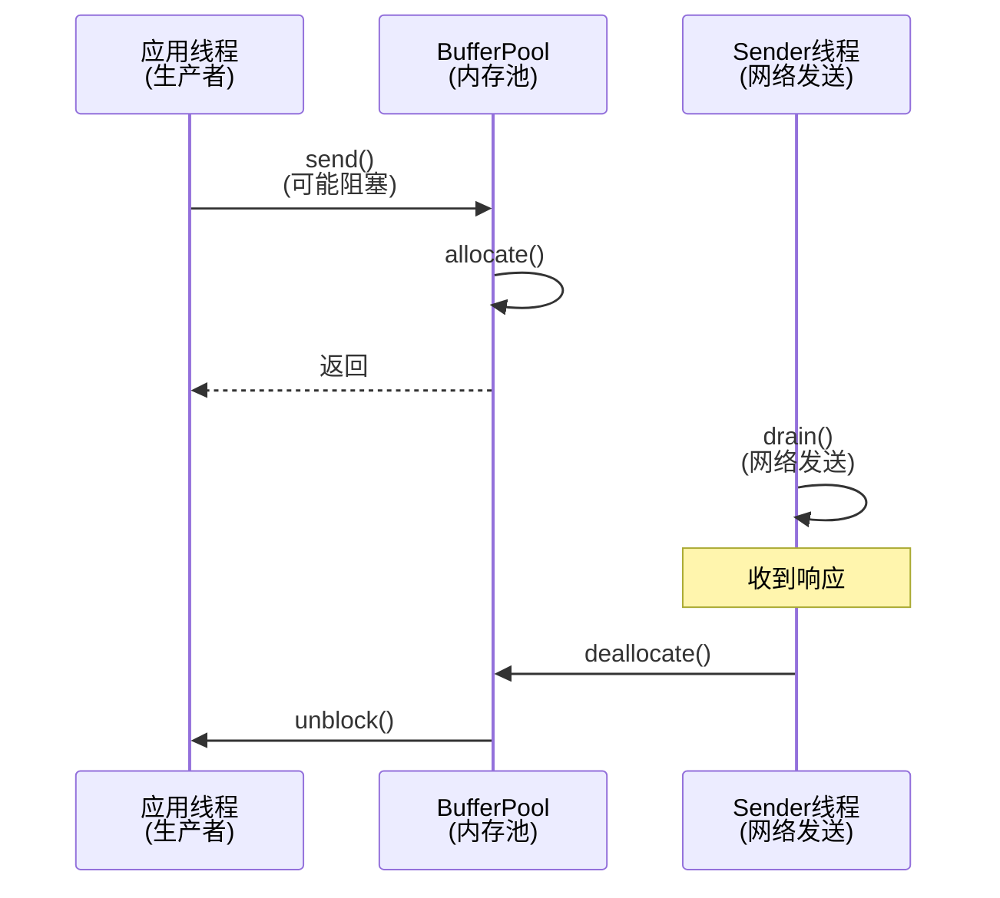
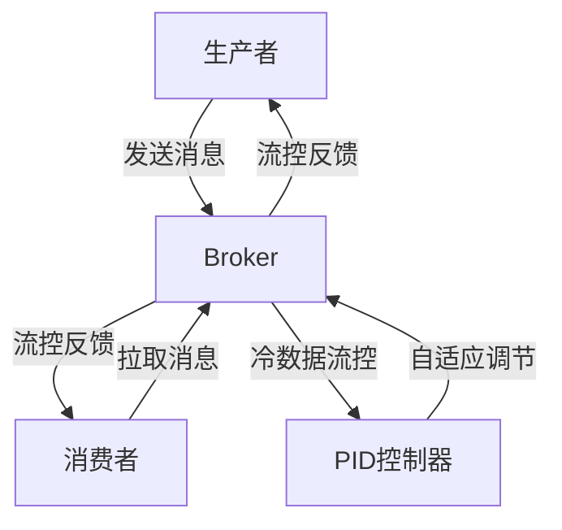

# 消息中间件背压机制深度解析

## 一、背压机制基础概念

### 1.1 什么是背压(Back Pressure)?

背压是一种流量控制机制,用于处理系统中生产者和消费者处理能力不匹配的情况。简单来说,就是当下游系统(消费者)处理数据的速度跟不上上游系统(生产者)产生数据的速度时,需要一种机制来对上游进行限流,从而保护系统不会因为负载过高而崩溃。

### 1.2 为什么需要背压机制?

1. **系统稳定性保护**
   - 防止消费者被大量数据压垮
   - 避免内存溢出(OOM)问题
   - 保持系统的可用性和稳定性

2. **资源合理利用**
   - 在系统负载高峰期合理分配资源
   - 避免资源浪费和过度消耗
   - 实现系统的最优性能

3. **流量调节与控制**
   - 自适应调节处理速率
   - 平滑处理突发流量
   - 确保服务质量(QoS)

## 二、Kafka生产者背压机制深度解析

### 2.1 概述

Kafka生产者通过**BufferPool内存池**实现了一套巧妙的天然背压机制。这套机制的核心思想是：**将本地内存分配与远程网络传输的生命周期绑定**，通过内存占用状态来感知网络压力，从而自动调节生产速度。

### 2.2 核心组件架构



### 2.3 关键源码分析

#### 2.3.1 内存分配入口：RecordAccumulator.append()

```java
// f:\kafka\clients\src\main\java\org\apache\kafka\clients\producer\internals\RecordAccumulator.java
public RecordAppendResult append(String topic, int partition, long timestamp, byte[] key, byte[] value, 
                                Header[] headers, AppendCallbacks callbacks, long maxTimeToBlock, 
                                long nowMs, Cluster cluster) throws InterruptedException {
    
    // 1. 尝试添加到现有批次
    RecordAppendResult appendResult = tryAppend(timestamp, key, value, headers, callbacks, dq, nowMs);
    if (appendResult != null) {
        return appendResult; // 成功添加，无需分配新内存
    }

    // 2. 现有批次装不下，需要创建新批次
    if (buffer == null) {
        int size = Math.max(this.batchSize, AbstractRecords.estimateSizeInBytesUpperBound(
                RecordBatch.CURRENT_MAGIC_VALUE, compression.type(), key, value, headers));
        log.trace("Allocating a new {} byte message buffer for topic {} partition {} with remaining timeout {}ms", 
                  size, topic, effectivePartition, maxTimeToBlock);
        
        // 🔥 关键：这里会阻塞！
        buffer = free.allocate(size, maxTimeToBlock);
    }
    
    // 3. 创建新批次并使用分配的内存
    RecordAppendResult appendResult = appendNewBatch(topic, effectivePartition, dq, timestamp, key, value, 
                                                    headers, callbacks, buffer, nowMs);
    if (appendResult.newBatchCreated)
        buffer = null; // 内存已被批次持有，防止重复释放
        
    return appendResult;
}
```

#### 2.3.2 内存池核心：BufferPool.allocate()

```java
// f:\kafka\clients\src\main\java\org\apache\kafka\clients\producer\internals\BufferPool.java
public ByteBuffer allocate(int size, long maxTimeToBlockMs) throws InterruptedException {
    // 1. 基础检查
    if (size > this.totalMemory)
        throw new IllegalArgumentException("Attempt to allocate " + size + " bytes, but there is a hard limit of " 
                                         + this.totalMemory + " on memory allocations.");

    ByteBuffer buffer = null;
    this.lock.lock();
    try {
        // 2. 快速路径：从池化缓存获取
        if (size == poolableSize && !this.free.isEmpty())
            return this.free.pollFirst();

        // 3. 检查是否有足够内存立即满足请求
        int freeListSize = freeSize() * this.poolableSize;
        if (this.nonPooledAvailableMemory + freeListSize >= size) {
            // 有足够内存，立即分配
            freeUp(size);
            this.nonPooledAvailableMemory -= size;
        } else {
            //  内存不足，进入阻塞等待
            int accumulated = 0;
            Condition moreMemory = this.lock.newCondition();
            long remainingTimeToBlockNs = TimeUnit.MILLISECONDS.toNanos(maxTimeToBlockMs);
            
            // FIFO队列：先等待的先获得内存
            this.waiters.addLast(moreMemory);
            
            // 循环等待直到获得足够内存
            while (accumulated < size) {
                long startWaitNs = time.nanoseconds();
                boolean waitingTimeElapsed = !moreMemory.await(remainingTimeToBlockNs, TimeUnit.NANOSECONDS);
                
                // 记录等待时间用于监控
                long endWaitNs = time.nanoseconds();
                long timeNs = Math.max(0L, endWaitNs - startWaitNs);
                recordWaitTime(timeNs);

                if (waitingTimeElapsed) {
                    // 超时抛出异常
                    throw new BufferExhaustedException("Failed to allocate " + size + " bytes within " + 
                        "the configured max blocking time " + maxTimeToBlockMs + " ms. " +
                        "Total memory: " + totalMemory() + " bytes. " +
                        "Available memory: " + availableMemory() + " bytes.");
                }

                // 尝试分配内存
                if (accumulated == 0 && size == this.poolableSize && !this.free.isEmpty()) {
                    buffer = this.free.pollFirst();
                    accumulated = size;
                } else {
                    freeUp(size - accumulated);
                    int got = (int) Math.min(size - accumulated, this.nonPooledAvailableMemory);
                    this.nonPooledAvailableMemory -= got;
                    accumulated += got;
                }
            }
        }
    } finally {
        // 唤醒下一个等待者
        if (!(this.nonPooledAvailableMemory == 0 && this.free.isEmpty()) && !this.waiters.isEmpty())
            this.waiters.peekFirst().signal();
        lock.unlock();
    }

    // 分配实际的ByteBuffer
    return buffer == null ? safeAllocateByteBuffer(size) : buffer;
}
```

#### 2.3.3 内存释放：Sender线程的响应处理

```java
// f:\kafka\clients\src\main\java\org\apache\kafka\clients\producer\internals\Sender.java
private void completeBatch(ProducerBatch batch, ProduceResponse.PartitionResponse response) {
    if (transactionManager != null) {
        transactionManager.handleCompletedBatch(batch, response);
    }

    // 🔥 关键：标记批次完成并释放内存
    if (batch.complete(response.baseOffset, response.logAppendTime)) {
        maybeRemoveAndDeallocateBatch(batch);
    }
}

private void maybeRemoveAndDeallocateBatch(ProducerBatch batch) {
    maybeRemoveFromInflightBatches(batch);
    // 🔥 释放内存回BufferPool
    this.accumulator.deallocate(batch);
}
```

```java
// f:\kafka\clients\src\main\java\org\apache\kafka\clients\producer\internals\RecordAccumulator.java
public void deallocate(ProducerBatch batch) {
    incomplete.remove(batch);
    if (!batch.isSplitBatch())
        free.deallocate(batch.buffer(), batch.initialCapacity()); // 调用BufferPool释放
}
```

```java
// f:\kafka\clients\src\main\java\org\apache\kafka\clients\producer\internals\BufferPool.java
public void deallocate(ByteBuffer buffer, int size) {
    lock.lock();
    try {
        if (size == this.poolableSize && size == buffer.capacity()) {
            // 标准大小的buffer，回收到池中
            buffer.clear();
            this.free.add(buffer);
        } else {
            // 非标准大小，直接释放内存计数
            this.nonPooledAvailableMemory += size;
        }
        
        // 🔥 关键：唤醒等待的线程
        Condition moreMem = this.waiters.peekFirst();
        if (moreMem != null)
            moreMem.signal();
    } finally {
        lock.unlock();
    }
}
```

### 2.4 背压机制的工作原理

#### 2.4.1 内存占用生命周期

```
1. 创建批次时分配内存
   ↓
2. 批次发送到网络
   ↓
3. 内存被持有(等待网络响应)
   ↓
4. 收到Broker响应
   ↓
5. 释放内存回BufferPool
   ↓
6. 唤醒等待的生产者线程
```

#### 2.4.2 背压触发条件

```java
// 可用内存计算
public long availableMemory() {
    return this.nonPooledAvailableMemory + freeSize() * (long) this.poolableSize;
}

// 阻塞条件
if (可用内存 < 新请求的内存大小) {
    // 进入FIFO等待队列，直到有内存释放
    waitForMemoryRelease();
}
```

## 三、Kafka Broker端背压机制：分布式限流器

### 3.1 用限流器理解Broker背压

Broker端背压本质上就是一个**智能限流器**，就像现实中常见的限流场景：

### 🚦 限流器类比

| 现实场景 | Kafka Broker背压 |
|---------|-----------------|
| **景区限流** | 每个客户端有访问配额 |
| **测速检查** | 实时监控请求速率 |
| **临时封路** | 超速连接暂时静音 |
| **定时开放** | 延迟队列到期恢复 |

### 3.2 Broker限流器的工作原理

#### 3.2.1 令牌桶算法 - 速率检测

```scala
// ClientQuotaManager.scala - 核心限流逻辑
def maybeRecordAndGetThrottleTimeMs(clientId: String, requestSize: Double): Int = {
  // 1. 记录本次请求消耗的资源
  clientMetrics.record(requestSize)
  
  // 2. 检查是否超过配额限制（类似令牌桶检查）
  val throttleTimeMs = clientMetrics.throttleTime()
  
  // 3. 返回需要限流的时间
  if (throttleTimeMs > 0) throttleTimeMs.toInt else 0
}
```

**限流逻辑**：
- 每个客户端都有自己的"令牌桶"（配额）
- 每次请求消耗一定的"令牌"（字节数/请求数）
- 令牌用完了就需要等待恢复（throttle时间）

#### 3.2.2 连接熔断 - 临时隔离

```scala
// SocketServer.scala - 限流执行
def processNewResponses(): Unit = {
  currentResponse match {
    case _: StartThrottlingResponse =>
      // 🔥 触发熔断：暂停处理该客户端请求
      muteChannel(channelId)  // 类似熔断器的OPEN状态
      
    case _: EndThrottlingResponse =>  
      // 🔥 恢复服务：重新处理该客户端请求
      unmuteChannel(channelId)  // 类似熔断器的CLOSED状态
  }
}
```

**熔断机制**：
- **CLOSED状态**：正常处理请求
- **OPEN状态**：超速时暂停处理，连接"静音"
- **自动恢复**：延迟时间到后自动回到CLOSED状态

#### 3.2.3 延迟队列 - 限流恢复

```java
// ThrottledChannel.java - 延迟恢复机制
public class ThrottledChannel implements Delayed {
    private final long endTimeNanos;  // 限流结束时间
    
    // 检查是否到了恢复时间
    public long getDelay(TimeUnit unit) {
        return unit.convert(endTimeNanos - currentTime, TimeUnit.NANOSECONDS);
    }
}
```

**定时恢复**：
- 被限流的连接放入延迟队列
- 后台线程定期检查队列
- 时间到了自动解除限流

### 3.3 限流模式

#### 3.3.1 Kafka Broker = 滑动窗口限流器

```
┌─────────────────────────────────────┐
│  滑动时间窗口（比如10秒）            │
│  ┌──┬──┬──┬──┬──┬──┬──┬──┬──┬──┐   │
│  │  │  │  │  │  │  │  │██│██│██│   │ 
│  └──┴──┴──┴──┴──┴──┴──┴──┴──┴──┘   │
│                      ↑              │
│               最近3秒请求过多，限流！   │
└─────────────────────────────────────┘
```

#### 3.3.2 限流效果

| 客户端速率 | 配额限制 | 限流时间 | 效果 |
|-----------|---------|---------|------|
| 800 req/s | 1000 req/s | 0ms | ✅ 正常通行 |
| 1200 req/s | 1000 req/s | 2000ms | ⏸️ 限流2秒 |
| 2000 req/s | 1000 req/s | 10000ms | 🚫 限流10秒 |

### 3.4 背压传导链

这个分布式限流器的妙处在于**无感知降速**：

```
📱 客户端疯狂发送
        ↓
🔍 Broker检测超速 (限流器触发)
        ↓  
🔇 连接静音 (熔断器打开)
        ↓
📦 TCP缓冲区堆积 (自然反压)
        ↓
😔 客户端感受到变慢 (被迫降速)
        ↓
⏰ 时间到恢复连接 (熔断器关闭)
```

**关键优势**：
- **无需修改客户端**：客户端无感知，自动适应
- **精确控制**：可以精确到字节级的速率控制  
- **公平隔离**：恶意客户端不影响其他客户端
- **自动恢复**：不需要人工干预，系统自愈

这就是为什么Kafka能处理大规模流量的秘密武器 - 一个设计精妙的**分布式自适应限流器**！ 
kafka的设计就是如此迷人，其实两个限流器单拿出来都不是什么特别厉害的限流器。
我们如果只独立持有producer限流器，他只知道自己这个实例的情况，但无法感知其他producer的行为，如果其他produer流量过大阻塞了bufferpool，他只能阻止自己，不能阻止整个Broker集群被拖垮。
如果独立存在的是Broker端的限流器，他只能通过静音连接+TCP缓冲区堆积来迫使客户端降速，是一种间接的方式，客户端不会明确收到一个要降速的命令，正是因为bufferpool的存在，他才能够发会自己的功效。
这就是kafka当中相辅相成的限流机制。

## 四、RocketMQ背压机制深度解析

### 4.1 概述

RocketMQ实现了多层次的背压机制，包括生产者端、消费者端和Broker端。其中最具特色的是基于PID（比例-积分-微分）控制算法的自适应流控机制，这让RocketMQ能够更智能地应对系统压力。

### 4.2 核心组件架构



### 4.3 多层次背压机制

#### 4.3.1 消费者端背压

消费者采用了多维度的阈值控制：

```java
// 消息数量阈值控制
if (cachedMessageCount > defaultMQPushConsumer.getPullThresholdForQueue()) {
    this.executePullRequestLater(pullRequest, PULL_TIME_DELAY_MILLS_WHEN_CACHE_FLOW_CONTROL);
}

// 消息大小阈值控制
if (cachedMessageSizeInMiB > defaultMQPushConsumer.getPullThresholdSizeForQueue()) {
    this.executePullRequestLater(pullRequest, PULL_TIME_DELAY_MILLS_WHEN_CACHE_FLOW_CONTROL);
}
```

当消费者本地缓存的消息数量或大小超过阈值时，会触发背压，暂停拉取新消息。

#### 4.3.2 生产者端背压

生产者端主要通过异步发送队列的长度来实现背压：

```java
// 异步发送流控
while (e.getQueue().size() > MAX_LENGTH_ASYNC_QUEUE) {
    Thread.sleep(SLEEP_FOR_A_WHILE);
}
```

#### 4.3.3 Broker端智能背压

Broker端采用了基于PID算法的自适应流控机制：

```java
public class PIDAdaptiveColdCtrStrategy implements ColdCtrStrategy {
    // PID控制参数
    private static final Double KP = 0.5;  // 比例系数
    private static final Double KI = 0.3;  // 积分系数
    private static final Double KD = 0.2;  // 微分系数
    
    @Override
    public Double decisionFactor() {
        Long et1 = historyEtValList.get(historyEtValList.size() - 1); // 当前误差
        Long et2 = historyEtValList.get(historyEtValList.size() - 2); // 上一次误差
        Long differential = et1 - et2;  // 误差变化率
        Double integration = 0.0;  // 误差积分
        for (Long item: historyEtValList) {
            integration += item;
        }
        return KP * et + KI * integration + KD * differential;
    }
}
```

在RocketMQ中：
- P控制：当前消费速率与期望值的偏差
- I控制：历史累积偏差
- D控制：偏差变化趋势

#### 4.3.4 冷热数据智能流控

RocketMQ在冷热数据处理上设计了精妙的自适应机制：

##### 4.3.4.1 动态加速减速

```java
@Override
public void promote(String consumerGroup, Long currentThreshold) {
    if (decisionFactor() > 0) {
        // 当决策因子为正时，提高阈值，加速消费
        coldDataCgCtrService.addOrUpdateGroupConfig(consumerGroup, 
            (long)(currentThreshold * 1.5));  // 提速50%
    }
}

@Override
public void decelerate(String consumerGroup, Long currentThreshold) {
    if (decisionFactor() < 0) {
        // 当决策因子为负时，降低阈值，减缓消费
        long changedThresholdVal = (long)(currentThreshold * 0.8);  // 降速20%
        // 保证不低于最小阈值
        if (changedThresholdVal < coldDataCgCtrService.getBrokerConfig().getCgColdReadThreshold()) {
            changedThresholdVal = coldDataCgCtrService.getBrokerConfig().getCgColdReadThreshold();
        }
        coldDataCgCtrService.addOrUpdateGroupConfig(consumerGroup, changedThresholdVal);
    }
}
```

##### 4.3.4.2 场景自适应控制

```java
if (cgNeedColdDataFlowCtr) {
    boolean isMsgLogicCold = defaultMessageStore.getCommitLog()
        .getColdDataCheckService().isMsgInColdArea(...);
    if (isMsgLogicCold) {
        // 区分消费场景
        if (consumeType == ConsumeType.CONSUME_PASSIVELY) {
            response.setCode(ResponseCode.SYSTEM_BUSY);  // 被动消费直接流控
        } else if (consumeType == ConsumeType.CONSUME_ACTIVELY) {
            requestHeader.setMaxMsgNums(1);  // 主动消费降低批量
        }
    }
}
```

##### 4.3.4.3 历史压力感知

```java
@Override
public void collect(Long globalAcc) {
    et = expectGlobalVal - globalAcc;  // 计算当前误差
    historyEtValList.add(et);         // 记录历史误差
    // 维护滑动窗口
    while (historyEtValList.size() > MAX_STORE_NUMS) {
        iterator.next();
        iterator.remove();
    }
}
```

### 4.4 流控优势

1. **智能调节**
   - 自动感知系统压力
   - 动态调整流控阈值
   - 防止系统过载

2. **分级管控**
   - 热数据优先保障
   - 冷数据按需控制
   - 差异化处理策略

3. **自我优化**
   - 系统空闲时加速
   - 压力大时主动降速
   - 持续寻找最佳平衡点

### 4.5 最佳实践

1. 合理配置初始阈值：
```java
defaultMQPushConsumer.setPullThresholdForQueue(1000);
defaultMQPushConsumer.setPullThresholdSizeForQueue(100); //MB
```

2. 启用PID控制：
```java
brokerConfig.setUsePIDColdCtrStrategy(true);
```

3. 监控流控指标：
```java
log.warn("Flow control triggered, currentAcc={}, threshold={}", 
    globalAcc, brokerConfig.getGlobalColdReadThreshold());
```

RocketMQ的背压机制展现了其在消息中间件设计上的深厚功力，通过PID控制这样的自动控制理论，实现了一个智能的流量调节系统。这种设计既保护了系统，又能最大化地利用系统资源。
